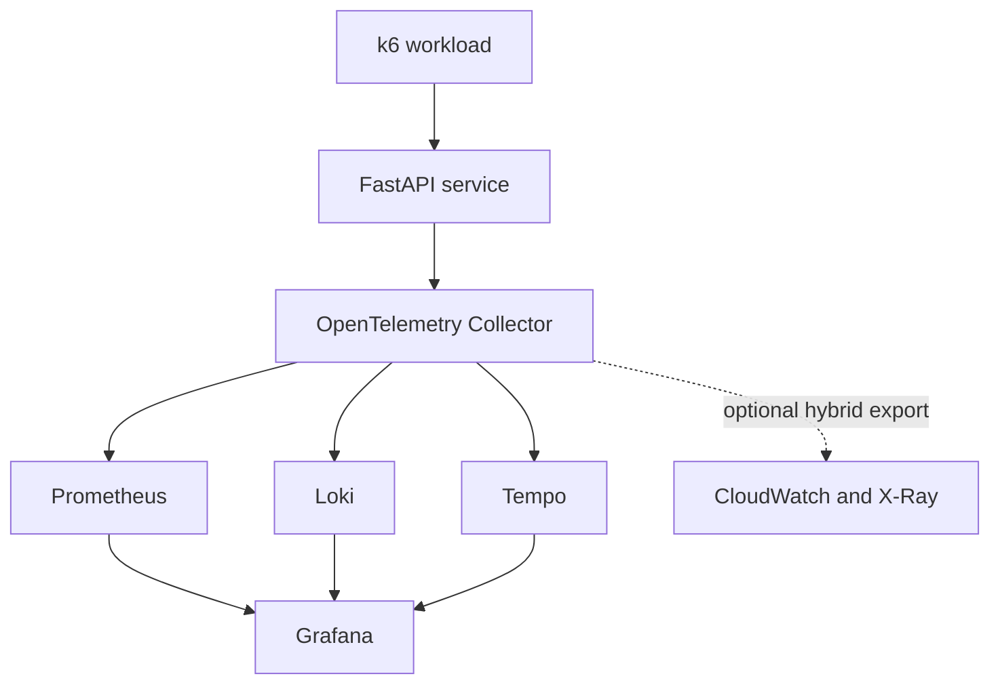

# Hybrid Observability Platform

[](https://github.com/itamarsb/hybrid-observability-platform/actions/workflows/app-ci.yml)

A local-first observability platform that collects and correlates metrics, logs, and traces from an instrumented FastAPI service. The project uses OpenTelemetry and the Grafana observability stack, with an optional AWS integration for short-lived hybrid validation.

> **Status:** instrumented FastAPI application baseline implemented. The local observability stack and hybrid deployment remain pending. See the [roadmap](#roadmap).

## What this project demonstrates

- vendor-neutral application instrumentation with OpenTelemetry;
- multi-signal telemetry pipelines through the OpenTelemetry Collector;
- metrics, logs, and traces with Prometheus, Loki, and Tempo;
- Grafana dashboards and cross-signal investigation;
- repeatable local deployment with Docker Compose;
- controlled load generation with K6;
- optional CloudWatch and X-Ray export provisioned with Terraform;
- practical controls for secrets, retention, cardinality, and cloud cost.

## Architecture



Local storage is the default. AWS export must be enabled explicitly and does not replace the local backends.

| Signal | Source | Local destination | Optional AWS destination |
|---|---|---|---|
| Metrics | FastAPI / Collector | Prometheus | CloudWatch Metrics |
| Logs | FastAPI / containers | Loki | CloudWatch Logs |
| Traces | FastAPI | Tempo | AWS X-Ray |
| Visualization | All backends | Grafana | AWS consoles / Grafana data sources |

More detail is available in [docs/architecture.md](docs/architecture.md).

## Technology stack

| Area | Technology |
|---|---|
| Reference workload | Python, FastAPI, Uvicorn |
| Instrumentation and collection | OpenTelemetry SDK and Collector |
| Metrics | Prometheus |
| Logs | Loki |
| Traces | Tempo |
| Visualization | Grafana |
| Load testing | K6 |
| Local orchestration | Docker Compose |
| AWS provisioning | Terraform |
| CI | GitHub Actions |

## Operating modes

### Local

The default mode runs without an AWS account or AWS credentials. Telemetry remains in project-owned local volumes with bounded retention.

### Hybrid

Hybrid mode adds selected AWS exporters while keeping the local pipeline active. It is intended for short-lived integration validation, not permanent duplication of all telemetry.

## Repository layout

The implementation will use the following layout as components are delivered:

```text
.
├── .github/workflows/        # CI checks
├── app/                      # Instrumented FastAPI service and tests
├── deployments/              # Local and hybrid Compose definitions
├── docs/
│   ├── adr/                  # Architecture decision records
│   ├── architecture.md       # System design and data flow
│   ├── operations/           # Runbooks and troubleshooting
│   └── screenshots/          # Reviewed demonstration evidence
├── infrastructure/terraform/ # Optional AWS resources
├── load-testing/k6/          # Controlled workload scenarios
├── observability/            # Collector, backend, and dashboard config
└── scripts/                  # Validation and lifecycle tools
```

Directories are added when they contain working artifacts; empty placeholders are intentionally avoided.

## Engineering decisions

- [ADR 0001 — Use the OpenTelemetry Collector](docs/adr/0001-use-opentelemetry-collector.md)
- [ADR 0002 — Use a local Grafana observability stack](docs/adr/0002-use-prometheus-instead-of-mimir.md)
- [ADR 0003 — Keep local telemetry ephemeral](docs/adr/0003-store-telemetry-locally.md)
- [ADR 0004 — Make AWS export optional](docs/adr/0004-make-cloudwatch-export-optional.md)

## Guardrails

- Local mode is the safe default.
- Secrets, credentials, Terraform state, and runtime telemetry are never committed.
- Observability interfaces bind locally unless a documented scenario requires otherwise.
- Retention starts at 48 hours for metrics and 24 hours for logs and traces.
- Trace sampling, log filtering, and metric cardinality are validated before AWS export.
- Hybrid resources are tagged, time-bounded, and removed after validation.
- Screenshots and sample data must not expose account IDs, credentials, tokens, or personal data.

See [SECURITY.md](SECURITY.md) for vulnerability reporting and security expectations.

## Roadmap

- [x] Define architecture, scope, and engineering decisions
- [x] Implement and test the instrumented FastAPI service
- [X] Add the local OpenTelemetry, Prometheus, Loki, Tempo, and Grafana stack
- [ ] Provision dashboards, data sources, alerts, and recording rules
- [ ] Add K6 workloads and failure scenarios
- [ ] Provision the optional AWS path with Terraform
- [ ] Add automated validation, security scanning, and cleanup checks
- [ ] Publish reproducible screenshots and an end-to-end demonstration

## Definition of done

The first release is complete when a new user can clone the repository, start local mode with documented prerequisites, generate a controlled workload, investigate one request across metrics, logs, and traces, run automated checks, and remove all project data using documented commands. Hybrid mode must additionally prove bounded AWS export and successful cleanup.

## Non-goals

- production hosting or 24/7 availability;
- a managed observability service;
- long-term telemetry archival;
- production compliance certification;
- a Kubernetes deployment in the initial release;
- monitoring third-party systems without authorization.

## License

Licensed under the [Apache License 2.0](LICENSE).


---

## 📈 Repository Metrics

<p align="center">

<a href="https://info.flagcounter.com/2wro"></a>

</p>


