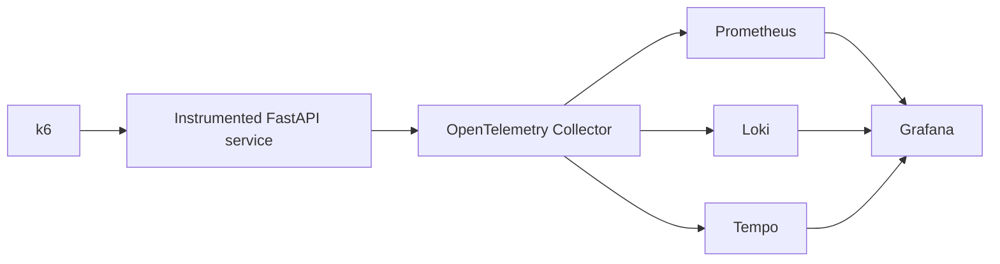
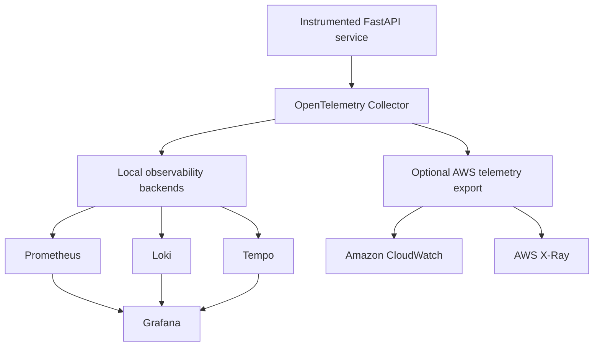

# Hybrid Observability Platform

A vendor-neutral observability reference implementation for collecting, processing, storing, correlating, and visualizing application telemetry across local and optional AWS environments.

The platform combines OpenTelemetry with Prometheus, Loki, Tempo, and Grafana. An optional hybrid deployment mode forwards a controlled subset of telemetry to Amazon CloudWatch and AWS X-Ray without making AWS the primary long-term telemetry backend.

> [!IMPORTANT]
> This repository is currently in the architecture and engineering baseline phase.
> Runtime components, dashboards, infrastructure modules, and operational automation will be added incrementally and identified explicitly as they become available.

---

## Purpose

This project evaluates a practical hybrid observability architecture with the following objectives:

* collect metrics, logs, and traces through OpenTelemetry;
* maintain vendor-neutral telemetry pipelines;
* correlate the three observability signals;
* store laboratory telemetry locally with controlled retention;
* minimize recurring cloud observability costs;
* support an optional and temporary AWS integration;
* provision AWS resources through Terraform;
* validate application behavior under controlled workloads;
* maintain reproducible deployment and decommissioning procedures;
* document architectural and operational decisions.

The project is designed as an engineering implementation rather than a beginner-oriented tutorial.

Documentation focuses on architecture, deployment contracts, configuration, validation, security, cost control, operational procedures, failure scenarios, and known limitations.

---

## Architecture

The platform provides two deployment modes:

1. **Local mode** — telemetry is processed and stored locally.
2. **Hybrid mode** — local storage remains authoritative while a controlled subset of telemetry is also exported to AWS.

### Local mode



Local mode is the default operating model.

Metrics, logs, and traces remain on the local workstation and are subject to explicit retention policies.

### Hybrid mode



Hybrid mode is intended for short validation windows and integration testing. It is not intended to continuously duplicate all locally generated telemetry in AWS.

---

## Telemetry Pipeline

The platform is designed around the three primary observability signals.

| **Signal**        | **Collection**    | **Local backend**        | **Optional AWS destination**        |
| ------------- | ------------- | -------------------- | ------------------------------- |
| Metrics       | OpenTelemetry | Prometheus           | Amazon CloudWatch               |
| Logs          | OpenTelemetry | Loki                 | CloudWatch Logs                 |
| Traces        | OpenTelemetry | Tempo                | AWS X-Ray                       |
| Visualization | Grafana       | Grafana data sources | CloudWatch and X-Ray interfaces |

OpenTelemetry provides the collection and processing layer between instrumented workloads and telemetry backends.

This separation allows storage destinations to change without requiring the application instrumentation strategy to be redesigned.

---

## Technology Stack

| Layer                | Technology              | Responsibility                                                   |
| -------------------- | ----------------------- | ---------------------------------------------------------------- |
| Application          | FastAPI                 | Instrumented reference workload                                  |
| Instrumentation      | OpenTelemetry SDK       | Application telemetry generation                                 |
| Collection           | OpenTelemetry Collector | Telemetry reception, processing, filtering, batching, and export |
| Metrics              | Prometheus              | Local time-series storage and querying                           |
| Logs                 | Loki                    | Local log aggregation and querying                               |
| Traces               | Tempo                   | Local distributed trace storage and querying                     |
| Visualization        | Grafana                 | Dashboards, exploration, and signal correlation                  |
| Load generation      | k6                      | Controlled traffic, latency, and error generation                |
| Local deployment     | Docker Compose          | Reproducible service orchestration                               |
| Cloud infrastructure | Terraform               | Optional AWS resource provisioning                               |
| Cloud integration    | CloudWatch and X-Ray    | Temporary hybrid telemetry validation                            |
| Automation           | GitHub Actions          | Static validation, tests, and security checks                    |

---

## Design Principles

### Vendor-neutral instrumentation

Application code sends telemetry using OpenTelemetry protocols and semantic conventions rather than depending directly on a single observability vendor.

### Local-first telemetry storage

The local observability stack is the primary storage destination. Cloud export is optional and controlled.

### Cost-aware cloud integration

CloudWatch and X-Ray integration must be explicitly enabled. Retention, telemetry volume, sampling, and resource lifecycle are treated as engineering constraints.

### Bounded data retention

Telemetry is retained only for the period required to validate the environment and produce operational evidence.

### Reproducible lifecycle

The platform must support repeatable deployment, validation, failure injection, shutdown, and data removal.

### Explicit architectural decisions

Significant technical decisions are recorded as Architecture Decision Records under `docs/adr/`.

### Least privilege

AWS resources and workloads must use narrowly scoped identities and permissions. Long-lived credentials must not be stored in the repository.

---

## Initial Retention Policy

The following values represent the initial engineering baseline and may be adjusted after measuring actual ingestion and storage behavior.

| Backend         |          Initial retention target |
| --------------- | --------------------------------: |
| Prometheus      |                          48 hours |
| Loki            |                          24 hours |
| Tempo           |                          24 hours |
| CloudWatch Logs | 1 day when hybrid mode is enabled |
| AWS traces      |     Short validation windows only |

Retention is not the only storage control. The implementation will also apply:

* bounded workload duration;
* controlled scrape intervals;
* log-level restrictions;
* trace sampling;
* batch processing;
* memory limits;
* telemetry filtering;
* local volume monitoring;
* explicit cleanup procedures.

---

## Security Model

The implementation will follow these baseline requirements:

* no credentials committed to version control;
* no secrets stored in Docker images;
* no Terraform state files committed;
* no unrestricted administrative ports;
* no public Grafana administration interface by default;
* no default production credentials;
* environment-specific configuration through ignored local files;
* least-privilege AWS IAM policies;
* AWS Systems Manager preferred over direct SSH access;
* restricted OpenTelemetry ingestion endpoints;
* explicit separation between local and hybrid deployment configuration;
* automated checks for secrets and insecure infrastructure definitions;
* sanitization of screenshots and operational evidence.

The project does not claim production compliance or regulatory certification.

Security controls are evaluated according to the scope and risk profile of this reference implementation.

---

## Cost Controls

The architecture minimizes AWS observability expenditure by keeping the primary telemetry backends local.

Hybrid AWS export will apply the following controls:

* disabled by default;
* limited execution windows;
* limited custom metric cardinality;
* no unnecessary high-resolution metrics;
* short CloudWatch Logs retention;
* controlled trace sampling;
* restricted workload generation;
* tagged AWS resources;
* cost estimation before deployment;
* explicit Terraform decommissioning;
* post-destroy resource verification.

The project will document expected costs and known services that can continue generating charges if not removed correctly.

---

## Planned Repository Structure

The target structure will be introduced incrementally as working components are implemented.

```text
hybrid-observability-platform/
├── .github/
│   └── workflows/
│
├── app/
│   ├── src/
│   ├── tests/
│   └── Dockerfile
│
├── deployments/
│   ├── local/
│   └── hybrid/
│
├── docs/
│   ├── adr/
│   ├── architecture/
│   ├── cost/
│   ├── operations/
│   └── security/
│
├── infrastructure/
│   └── terraform/
│       ├── environments/
│       │   └── aws-demo/
│       └── modules/
│
├── load-testing/
│   └── k6/
│
├── observability/
│   ├── grafana/
│   │   ├── dashboards/
│   │   └── provisioning/
│   ├── loki/
│   ├── otel-collector/
│   ├── prometheus/
│   └── tempo/
│
├── scripts/
├── tests/
├── .env.example
├── .gitignore
├── compose.yaml
├── LICENSE
├── Makefile
├── README.md
└── SECURITY.md
```

Directories will not be added as empty placeholders. Each directory will be introduced with functional configuration, documentation, code, or tests.

---

## Architecture Decision Records

The initial ADR set will document the following decisions:

| ADR      | Decision                                                                       |
| :------: | ------------------------------------------------------------------------------ |
| `0001`   | Use OpenTelemetry Collector as the telemetry processing layer                  |
| `0002`   | Use Prometheus instead of Grafana Mimir for the initial single-node deployment |
| `0003`   | Store primary telemetry locally                                                |
| `0004`   | Make CloudWatch and X-Ray export optional                                      |
| `0005`   | Apply bounded telemetry retention                                              |
| `0006`   | Run the initial platform on the development workstation                        |
| `0007`   | Separate the observability platform from the TCC2 laboratory environment       |

ADRs are considered immutable historical records. Superseded decisions will be replaced by new ADRs rather than silently rewritten.

---

## Implementation Status

| Component                         | Status        |
| --------------------------------- | :-----------: |
| Project scope                     | Defined       |
| Architectural model               | Defined       |
| Local-first storage strategy      | Defined       |
| Hybrid AWS strategy               | Defined       |
| Initial retention policy          | Defined       |
| Repository engineering baseline   | In progress   |
| Architecture Decision Records     | Planned       |
| FastAPI reference application     | Planned       |
| OpenTelemetry instrumentation     | Planned       |
| OpenTelemetry Collector pipelines | Planned       |
| Prometheus integration            | Planned       |
| Loki integration                  | Planned       |
| Tempo integration                 | Planned       |
| Grafana provisioning              | Planned       |
| Operational dashboards            | Planned       |
| k6 workload profiles              | Planned       |
| Terraform AWS environment         | Planned       |
| CloudWatch integration            | Planned       |
| X-Ray integration                 | Planned       |
| CI validation                     | Planned       |
| Security automation               | Planned       |
| Cost validation                   | Planned       |

No component marked as planned should be interpreted as already implemented or validated.

---

## Validation Strategy

The completed platform will be evaluated through:

* application health checks;
* telemetry pipeline health endpoints;
* metrics ingestion verification;
* log ingestion and querying;
* trace propagation verification;
* cross-signal correlation;
* controlled latency generation;
* controlled HTTP error generation;
* dashboard validation;
* retention verification;
* container resource monitoring;
* Terraform formatting and validation;
* infrastructure security scanning;
* AWS resource inventory checks;
* deployment and decommissioning tests.

Evidence will be generated from reproducible validation procedures rather than manually created sample values.

---

## Observability Scenarios

The reference application will expose controlled scenarios for validating platform behavior.

| Scenario               | Expected evidence                                      |
| ---------------------- | ------------------------------------------------------ |
| Normal traffic         | Stable request rate and successful traces              |
| Increased load         | Higher throughput and resource utilization             |
| Slow endpoint          | Increased latency percentiles and longer traces        |
| Application error      | Error-rate increase, correlated logs, and failed spans |
| Service restart        | Availability change and recovery evidence              |
| Collector interruption | Telemetry delivery failure and pipeline recovery       |
| Storage constraint     | Retention and resource-limit behavior                  |
| Optional AWS export    | Matching local and cloud telemetry evidence            |

Failure scenarios are designed for isolated project environments only.

---

## Non-Goals

The initial implementation is not intended to provide:

* a production-ready multi-tenant observability service;
* high availability across multiple hosts;
* long-term telemetry retention;
* unlimited telemetry ingestion;
* regulatory compliance certification;
* managed-service replacement guarantees;
* a Kubernetes deployment;
* a Grafana Mimir production cluster;
* a ClickHouse-based observability platform;
* permanent duplication of telemetry in AWS;
* a beginner-level installation tutorial.

These capabilities may be evaluated in future iterations but are outside the initial project scope.

---

## Known Limitations

The initial architecture will operate on a single development workstation.

Consequently:

* local telemetry is unavailable when the workstation is offline;
* local storage is not highly available;
* Docker resource allocation affects platform capacity;
* data may be intentionally deleted after short retention periods;
* local performance results must not be generalized to production scale;
* hybrid mode depends on AWS service availability and configured permissions;
* cost estimates may vary by region, usage volume, and AWS pricing changes.

Limitations will be updated as implementation evidence becomes available.

---

## Technical Roadmap

### Phase 1 — Engineering baseline

* establish repository conventions;
* create security and contribution policies;
* record initial ADRs;
* define configuration contracts;
* add static validation.

### Phase 2 — Local telemetry pipeline

* implement the FastAPI reference service;
* instrument the service with OpenTelemetry;
* configure OpenTelemetry Collector pipelines;
* deploy Prometheus, Loki, Tempo, and Grafana;
* validate metrics, logs, and traces.

### Phase 3 — Operational visibility

* provision Grafana data sources;
* build operational dashboards;
* implement cross-signal correlation;
* add controlled workload profiles;
* document failure and recovery scenarios.

### Phase 4 — Hybrid AWS integration

* implement reusable Terraform modules;
* provision the isolated AWS demonstration environment;
* enable optional CloudWatch and X-Ray export;
* validate IAM, telemetry flow, retention, and cost controls;
* destroy and verify removal of AWS resources.

### Phase 5 — Automation and hardening

* add continuous integration;
* add infrastructure and container security scanning;
* automate configuration validation;
* verify resource limits and retention;
* publish architecture and operational evidence.

---

## Documentation Model

Project documentation will be organized by engineering responsibility:

* `docs/adr/` — architectural decisions;
* `docs/architecture/` — system context, component design, and telemetry flows;
* `docs/operations/` — deployment, validation, troubleshooting, and decommissioning;
* `docs/security/` — threat considerations, identity, secrets, and exposure controls;
* `docs/cost/` — retention, resource consumption, AWS estimates, and cleanup verification.

Documentation must describe the current implementation state. Planned capabilities must remain clearly identified as planned.

---

## Contributing

The contribution model will be defined after the engineering baseline is established.

Proposed changes should preserve:

* vendor-neutral telemetry collection;
* reproducible deployment;
* explicit retention;
* bounded resource usage;
* secure defaults;
* optional cloud export;
* documented architectural decisions;
* accurate implementation status.

---

## License

This project is licensed under the [Apache License 2.0](LICENSE).

---

## Project Status

**Current phase:** Engineering baseline and architecture definition.

The next deliverables are:

1. repository security and ignore policies;
2. initial Architecture Decision Records;
3. local deployment configuration;
4. instrumented reference application;
5. local metrics, logs, and traces pipeline.

