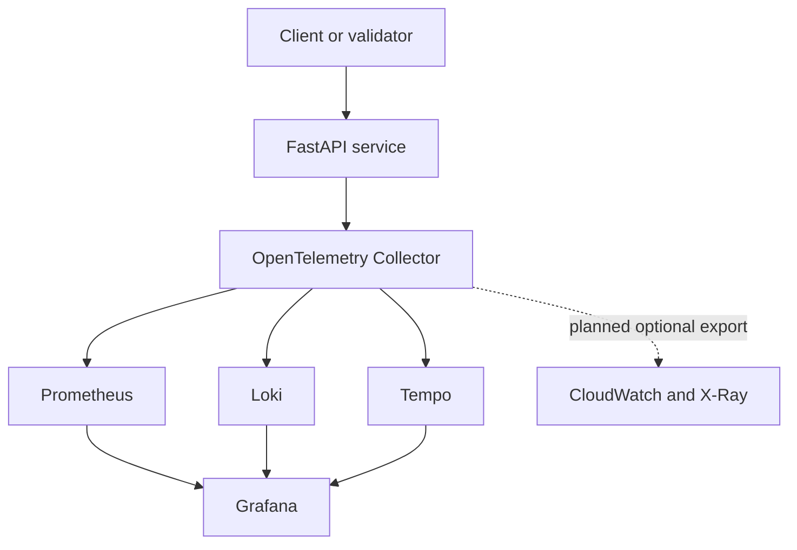
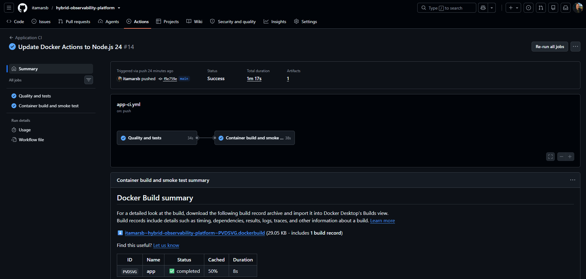
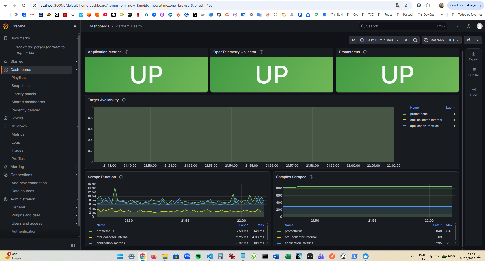
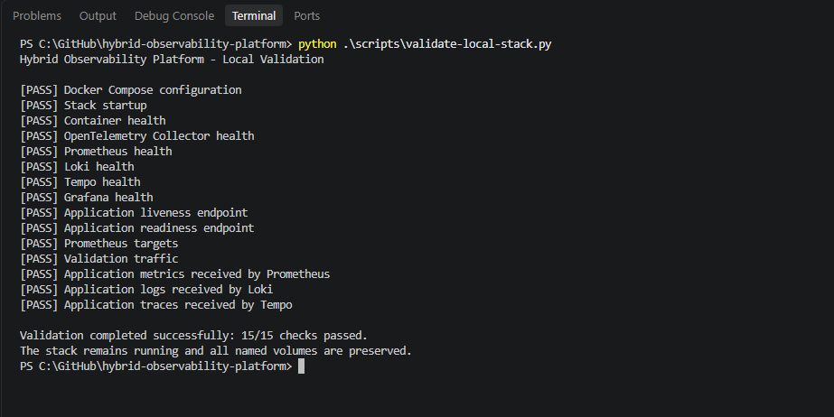

# Hybrid Observability Platform

[](https://github.com/itamarsb/hybrid-observability-platform/actions/workflows/app-ci.yml)

A local-first observability platform that collects metrics, logs, and traces from an
instrumented FastAPI service through OpenTelemetry. Prometheus, Loki, Tempo, and Grafana
provide local storage, querying, visualization, and investigation workflows. An optional
AWS integration is planned for short-lived hybrid validation.

> **Status:** the instrumented application, six-service local stack, provisioned Grafana
> health dashboard, application CI, and end-to-end local validator are operational. Load
> testing, alerting, platform CI, and the optional AWS path remain on the roadmap.

## What this project demonstrates

- vendor-neutral application instrumentation with OpenTelemetry;
- multi-signal telemetry pipelines through the OpenTelemetry Collector;
- local metrics, logs, and traces with Prometheus, Loki, and Tempo;
- provisioned Grafana data sources and a version-controlled platform health dashboard;
- repeatable local deployment with Docker Compose;
- controlled latency, dependency, and error scenarios;
- automated end-to-end validation of service health and telemetry delivery;
- application quality checks, tests, container build, and smoke testing in GitHub Actions;
- practical controls for secrets, retention, cardinality, and future cloud cost.

## Architecture



Local storage is the default. The future AWS export must be enabled explicitly and will
not replace the local backends.

| Signal | Source | Current local destination | Planned AWS destination |
|---|---|---|---|
| Metrics | FastAPI / Collector | Prometheus | CloudWatch Metrics |
| Logs | FastAPI / containers | Loki | CloudWatch Logs |
| Traces | FastAPI | Tempo | AWS X-Ray |
| Visualization | All local backends | Grafana | AWS consoles / Grafana data sources |

See [the architecture documentation](docs/architecture.md) for component responsibilities
and telemetry flows.

## Technology stack

| Area | Technology | Status |
|---|---|---|
| Reference workload | Python, FastAPI, Uvicorn | Implemented |
| Instrumentation and collection | OpenTelemetry SDK and Collector | Implemented |
| Metrics | Prometheus | Implemented |
| Logs | Loki | Implemented |
| Traces | Tempo | Implemented |
| Visualization | Grafana | Implemented |
| Local orchestration | Docker Compose | Implemented |
| Application CI | GitHub Actions | Implemented |
| End-to-end validation | Python standard library | Implemented |
| Load testing | k6 | Planned |
| AWS provisioning | Terraform | Planned |

## Quick start

### Prerequisites

- Python 3.12 or later;
- Docker Engine or Docker Desktop with Docker Compose v2;
- Git.

Clone the repository and enter its directory:

```bash
git clone https://github.com/itamarsb/hybrid-observability-platform.git
cd hybrid-observability-platform
```

Run the end-to-end validator on Windows PowerShell:

```powershell
python .\scripts\validate-local-stack.py
```

On Linux or macOS:

```bash
python3 ./scripts/validate-local-stack.py
```

The validator builds and starts the stack, checks all six services, generates controlled
traffic, and confirms that metrics, logs, and traces reached their respective backends.
It leaves the stack running and preserves all named volumes.

After validation, open:

| Interface | URL |
|---|---|
| Application API documentation | <http://127.0.0.1:8000/docs> |
| Grafana | <http://127.0.0.1:3000> |
| Prometheus | <http://127.0.0.1:9090> |

Grafana uses `admin` / `admin` by default in local mode unless the credentials are
overridden through environment variables.

Stop the containers and network while preserving telemetry and Grafana volumes:

```bash
docker compose down
```

Do not add `--volumes` or `-v` unless permanent deletion of all local project data is
intentional.

For the complete validation contract and troubleshooting guidance, see
[Local Stack Validation](docs/operations/local-stack-validation.md).

## Operating modes

### Local

The implemented default mode requires no AWS account or cloud credentials. Telemetry
remains in project-owned Docker volumes with bounded retention.

### Hybrid — planned

The planned hybrid mode will add selected AWS exporters while keeping the local pipeline
active. It is intended for short-lived integration validation rather than permanent
duplication of all telemetry.

## Repository layout

```text
.
├── .github/workflows/        # Application CI
├── app/                      # Instrumented FastAPI service and tests
├── docs/
│   ├── adr/                  # Architecture decision records
│   ├── operations/           # Validation and troubleshooting guides
│   ├── screenshots/          # Reviewed, sanitized evidence
│   └── architecture.md       # System design and telemetry flow
├── observability/
│   ├── collector/            # OpenTelemetry Collector configuration
│   ├── grafana/              # Provisioning and dashboard definitions
│   ├── loki/                 # Log backend configuration
│   ├── prometheus/           # Metrics backend configuration
│   └── tempo/                # Trace backend configuration
├── scripts/                  # Cross-platform validation tools
└── compose.yaml              # Local six-service platform
```

Directories are added only when they contain working artifacts. Planned components are
described in the roadmap instead of being represented by empty placeholders.

## Engineering decisions

- [ADR 0001 — Use the OpenTelemetry Collector](docs/adr/0001-use-opentelemetry-collector.md)
- [ADR 0002 — Use a local Grafana observability stack](docs/adr/0002-use-prometheus-instead-of-mimir.md)
- [ADR 0003 — Keep local telemetry ephemeral](docs/adr/0003-store-telemetry-locally.md)
- [ADR 0004 — Make AWS export optional](docs/adr/0004-make-cloudwatch-export-optional.md)

## Validation evidence

The repository keeps a small set of reviewed screenshots as reproducible engineering
evidence. Runtime telemetry and generated backend data remain outside Git.

### Application CI

Quality checks, automated tests, container build, and smoke testing complete successfully
in GitHub Actions.



### Provisioned platform health dashboard

Grafana queries provisioned Prometheus data and shows the application metrics endpoint,
OpenTelemetry Collector, and Prometheus targets as available.



### End-to-end local validation

The cross-platform validator confirms service health and verifies delivery of application
metrics to Prometheus, logs to Loki, and traces to Tempo.



## Guardrails

- Local mode is the safe default.
- Secrets, credentials, Terraform state, and runtime telemetry are never committed.
- Observability interfaces bind locally unless a documented scenario requires otherwise.
- Retention starts at 48 hours for metrics and 24 hours for logs and traces.
- Trace sampling, log filtering, and metric cardinality are validated before AWS export.
- Future hybrid resources must be tagged, time-bounded, and removed after validation.
- Screenshots and sample data must not expose account IDs, credentials, tokens, or
  personal data.

See [SECURITY.md](SECURITY.md) for vulnerability reporting and security expectations.

## Roadmap

- [x] Define architecture, scope, and engineering decisions
- [x] Implement and test the instrumented FastAPI service
- [x] Add the local OpenTelemetry, Prometheus, Loki, Tempo, and Grafana stack
- [x] Provision Grafana data sources and the platform health dashboard
- [x] Add reproducible end-to-end local validation
- [x] Publish baseline CI, dashboard, and validation evidence
- [ ] Add application telemetry dashboards and cross-signal investigation links
- [ ] Add alerting and Prometheus recording rules
- [ ] Add k6 workloads and sustained failure scenarios
- [ ] Run full-platform validation, security scanning, and cleanup checks in CI
- [ ] Provision the optional AWS path with Terraform
- [ ] Publish a complete metrics-to-logs-to-traces investigation runbook

## Definition of done

The first release is complete when a new user can clone the repository, start local mode,
generate a controlled workload, investigate one request across metrics, logs, and traces,
run automated platform checks in CI, and remove project resources through documented
commands. Hybrid mode must additionally prove bounded AWS export and successful cleanup.

## Non-goals

- production hosting or 24/7 availability;
- a managed observability service;
- long-term telemetry archival;
- production compliance certification;
- a Kubernetes deployment in the initial release;
- monitoring third-party systems without authorization.

## License

Licensed under the [Apache License 2.0](LICENSE).

---

## 📈 Repository Metrics

<p align="center">

<a href="https://info.flagcounter.com/2wro"></a>

</p>


