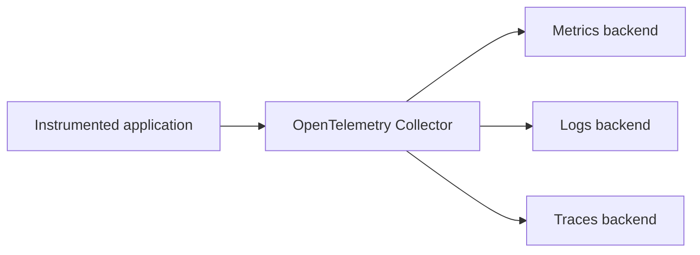

# ADR 0001: Use OpenTelemetry Collector as the Telemetry Processing Layer

- **Status:** Accepted
- **Date:** 2026-08-21
- **Decision owners:** Project maintainer
- **Scope:** Local and hybrid deployment modes

---

## Context

The Hybrid Observability Platform requires a consistent mechanism for receiving, processing, and routing application telemetry across local open-source backends and optional AWS destinations.

The platform handles three primary telemetry signals:

- metrics;
- logs;
- traces.

The initial local backends are:

- Prometheus for metrics;
- Loki for logs;
- Tempo for traces;
- Grafana for visualization and correlation.

The optional hybrid mode may also export a controlled subset of telemetry to:

- Amazon CloudWatch;
- CloudWatch Logs;
- AWS X-Ray.

Without an intermediary collection layer, the reference application would require separate integrations for each telemetry backend. This would couple application instrumentation to storage-specific protocols and make local and hybrid deployment modes more difficult to maintain.

The project requires a telemetry processing layer that:

- accepts standard OpenTelemetry Protocol traffic;
- supports metrics, logs, and traces;
- separates instrumentation from storage;
- allows independent routing for each signal;
- supports filtering and attribute transformation;
- provides batching and memory protection;
- permits trace sampling;
- supports local and optional cloud destinations;
- can run reproducibly through containers;
- avoids mandatory dependency on a commercial observability provider.

---

## Decision

The project will use the **OpenTelemetry Collector** as the central telemetry reception, processing, and routing layer.

The instrumented FastAPI application will export telemetry through OTLP to the Collector rather than sending telemetry directly to Prometheus, Loki, Tempo, CloudWatch, or X-Ray.

The initial pipeline model is:



The local deployment will route signals to:

| Signal | Destination |
|---|---|
| Metrics | Prometheus |
| Logs | Loki |
| Traces | Tempo |

The optional hybrid deployment may add controlled AWS exporters or supported AWS OTLP destinations without changing the application instrumentation contract.

The Collector configuration will be divided into explicit pipelines:

- `metrics`;
- `logs`;
- `traces`.

Each pipeline will define its own receivers, processors, exporters, and operational limits.

---

## Decision Drivers

The decision is based on the following requirements.

### Vendor-neutral instrumentation

The application should depend on OpenTelemetry APIs, SDKs, protocols, and semantic conventions instead of vendor-specific telemetry clients.

### Backend independence

Prometheus, Loki, Tempo, and AWS destinations must be replaceable or independently configurable without redesigning the application instrumentation.

### Multi-signal support

A single collection layer must handle metrics, logs, and traces.

### Local-first operation

The platform must operate without requiring a cloud observability service.

### Optional AWS integration

AWS export must be enabled only when required for hybrid validation.

### Controlled resource consumption

The telemetry pipeline must support batching, memory limits, filtering, sampling, and bounded queues.

### Signal processing

The platform requires a location where telemetry attributes can be:

- added;
- removed;
- normalized;
- filtered;
- redacted;
- transformed.

### Operational visibility

The collection layer must expose health and internal telemetry that can be used to detect pipeline failures, dropped data, queue saturation, and exporter errors.

---

## Collector Distribution

The initial local implementation will use the OpenTelemetry Collector Contrib distribution.

The Contrib distribution is selected because the platform requires integrations beyond the minimal core Collector component set.

Container image versions must be explicitly pinned after compatibility validation. The project must not rely permanently on floating image tags such as:

```text
latest
```

A Collector version upgrade must be reviewed for:

- deprecated components;
- removed exporters;
- configuration changes;
- semantic-convention changes;
- security advisories;
- backend compatibility;
- resource-consumption changes.

AWS-specific collector distributions or agents may be evaluated later, but they are not required for the initial local pipeline.

---

## Pipeline Responsibilities

The Collector will be responsible for the following functions.

### Reception

The Collector will accept OTLP through the protocols required by the implementation:

- OTLP over gRPC;
- OTLP over HTTP.

Receivers must bind only to the interfaces required by the deployment model.

### Processing

The initial processing baseline will include:

- batch processing;
- memory limiting;
- resource detection or explicit resource attribution;
- attribute filtering;
- sensitive-field removal;
- environment and service identification.

Additional processors may be introduced only when they solve a documented requirement.

### Export

The Collector will route each signal to its configured backend.

The local pipeline will remain functional without AWS credentials or AWS services.

Hybrid exporters must be isolated from the default local configuration so that enabling local mode cannot unintentionally send telemetry outside the workstation.

### Internal telemetry

Collector health and internal metrics will be exposed only within the project network or through a documented local interface.

Operational evidence should include:

- accepted telemetry;
- refused telemetry;
- exporter failures;
- dropped data;
- queue behavior;
- Collector memory consumption;
- Collector restart behavior.

---

## Deployment Modes

### Local mode

Local mode is the default.

```text
Application
    |
    v
OpenTelemetry Collector
    |
    +--> Prometheus
    +--> Loki
    +--> Tempo
```

Local mode must not require:

- AWS credentials;
- public internet exposure;
- CloudWatch Logs;
- custom CloudWatch metrics;
- AWS X-Ray;
- managed Grafana services.

### Hybrid mode

Hybrid mode extends the local pipeline.

```text
Application
    |
    v
OpenTelemetry Collector
    |
    +--> Prometheus
    +--> Loki
    +--> Tempo
    |
    +--> Optional AWS destinations
```

Hybrid mode must:

- be explicitly enabled;
- use temporary or role-based AWS credentials;
- apply trace sampling;
- restrict metric cardinality;
- filter sensitive attributes;
- limit execution duration;
- use short cloud retention;
- remain removable without changing application instrumentation.

The local backends remain the primary telemetry destinations unless a future ADR changes this decision.

---

## Configuration Strategy

Collector configuration will be stored as version-controlled YAML.

Configuration must distinguish between:

- common pipeline behavior;
- local exporters;
- optional hybrid exporters;
- environment-specific values;
- secrets and credentials.

Secrets must not appear in Collector configuration committed to the repository.

Environment-specific values may be provided through:

- environment variables;
- ignored local configuration;
- generated runtime configuration;
- AWS identity mechanisms.

Configuration changes must be validated before deployment.

---

## Security Considerations

The Collector is a privileged telemetry component because it can receive and forward operational data.

Security controls must account for the following risks:

- unauthorized telemetry ingestion;
- exposure of OTLP endpoints;
- sensitive attributes in logs or traces;
- credential leakage;
- telemetry exfiltration;
- denial of service through unbounded ingestion;
- excessive metric cardinality;
- queue and memory exhaustion;
- insecure exporter destinations;
- unencrypted remote communication.

The implementation must apply:

- restricted network exposure;
- bounded memory usage;
- bounded queues;
- telemetry filtering;
- sensitive-attribute removal;
- explicit exporter destinations;
- least-privilege AWS permissions;
- no credentials embedded in images;
- no secrets committed to Git.

OTLP endpoints must not be exposed publicly by default.

Transport encryption is required whenever telemetry leaves the isolated local project network.

---

## Cost Considerations

The Collector enables cost controls before telemetry reaches a cloud destination.

Hybrid pipelines may use processors and sampling policies to:

- reduce trace volume;
- remove unnecessary log records;
- prevent high-cardinality attributes from becoming metric dimensions;
- limit duplicated telemetry;
- exclude development noise;
- restrict AWS export to validation windows.

The Collector does not eliminate cloud charges by itself. Incorrect exporters, sampling, retention, or workload settings can still generate unexpected costs.

Cost controls must be validated through measurements rather than assumed from configuration alone.

---

## Alternatives Considered

### Direct export from the application to each backend

The application could send telemetry directly to Prometheus-compatible, Loki, Tempo, and AWS endpoints.

This option was rejected because it would:

- couple instrumentation to storage destinations;
- duplicate exporter configuration;
- complicate local and hybrid modes;
- distribute filtering logic across application instances;
- make centralized sampling and redaction more difficult.

### Grafana Alloy as the primary collector

Grafana Alloy supports OpenTelemetry components and integrates closely with the Grafana ecosystem.

This option was not selected for the initial implementation because the project intends to demonstrate the upstream OpenTelemetry Collector configuration model directly and maintain a vendor-neutral collection layer.

Grafana Alloy may be evaluated later through a separate ADR.

### Separate agents for each signal

The platform could use different agents for metrics, logs, and traces.

This option was rejected because it would:

- increase the number of deployed components;
- create multiple configuration models;
- increase operational overhead;
- complicate resource limits;
- weaken the single OTLP ingestion contract.

### Direct application export to AWS

The application could use AWS-specific telemetry libraries and send data directly to CloudWatch or X-Ray.

This option was rejected as the default because it would:

- increase AWS coupling;
- complicate local execution;
- create separate instrumentation paths;
- reduce backend portability;
- make cost controls less centralized.

### AWS Distro for OpenTelemetry

AWS Distro for OpenTelemetry provides an AWS-supported OpenTelemetry distribution.

It remains a valid option for AWS-specific environments but was not selected as the initial local collector because the primary deployment is local and vendor-neutral.

Its use may be reconsidered for AWS compute environments if it provides a documented operational or compatibility advantage.

### CloudWatch Agent as the primary collector

The CloudWatch Agent supports AWS-focused telemetry collection and OpenTelemetry ingestion capabilities.

It was not selected as the central platform collector because:

- the primary telemetry backends are local;
- CloudWatch integration is optional;
- the project requires a cloud-independent default path;
- the upstream Collector provides a clearer vendor-neutral processing contract.

The CloudWatch Agent may still be evaluated for AWS host-level telemetry in a future ADR.

---

## Consequences

### Positive consequences

- Application instrumentation remains backend-independent.
- Local and hybrid modes share the same ingestion contract.
- Metrics, logs, and traces use a common processing layer.
- Sensitive attributes can be filtered centrally.
- Trace sampling can be configured outside the application.
- Cloud export can be enabled without redesigning the application.
- Collector behavior can be tested independently.
- Telemetry pipelines become explicit and version-controlled.
- Additional backends can be evaluated without replacing instrumentation.

### Negative consequences

- The Collector becomes an additional runtime dependency.
- Incorrect Collector configuration can interrupt all telemetry signals.
- Collector availability affects telemetry delivery.
- Resource limits and queues require tuning.
- Configuration compatibility must be reviewed during upgrades.
- The Contrib distribution has a larger component and dependency surface than the core distribution.
- Pipeline troubleshooting requires understanding Collector internal telemetry.

### Operational risks

- Exporter failure may create backpressure.
- Unbounded queues may consume excessive memory or disk.
- Low memory limits may cause unnecessary telemetry drops.
- High-cardinality attributes may affect backend performance and cost.
- Incorrect routing may duplicate telemetry.
- Sensitive fields may reach unintended destinations.
- A public OTLP endpoint may permit resource exhaustion.

These risks must be addressed through configuration, testing, network isolation, and monitoring.

---

## Failure Behavior

The platform must explicitly validate Collector behavior under:

- unavailable Prometheus integration;
- unavailable Loki backend;
- unavailable Tempo backend;
- unavailable AWS destination;
- malformed telemetry;
- exporter timeout;
- queue saturation;
- memory pressure;
- Collector restart;
- application restart;
- temporary network interruption.

A backend failure must not be assumed to be harmless.

The implementation must document whether telemetry is:

- retried;
- queued;
- rejected;
- dropped;
- duplicated after retry.

---

## Validation Criteria

This decision will be considered successfully implemented when:

- the application exports OTLP without backend-specific code;
- the Collector receives metrics, logs, and traces;
- Prometheus receives application metrics;
- Loki receives application logs through a supported OTLP path;
- Tempo receives application traces;
- Grafana can query all three local backends;
- sensitive test attributes are removed before storage;
- memory-limiter behavior is observable;
- batch processing is active;
- Collector health is monitored;
- local mode operates without AWS credentials;
- hybrid mode can be enabled independently;
- AWS export can be disabled without changing application code;
- pipeline failures produce observable evidence;
- configuration validation is automated.

---

## Reversibility

This decision is reversible.

Replacing the Collector should not require extensive application changes as long as the replacement accepts the existing OTLP contract.

A replacement decision must document:

- protocol compatibility;
- processing capabilities;
- security implications;
- resource consumption;
- backend compatibility;
- cloud coupling;
- migration procedures.

Any replacement or material change to this decision requires a new ADR.

---

## References

- [OpenTelemetry Collector](https://opentelemetry.io/docs/collector/)
- [OpenTelemetry Collector configuration](https://opentelemetry.io/docs/collector/configuration/)
- [OpenTelemetry Protocol specification](https://opentelemetry.io/docs/specs/otlp/)
- [Grafana Loki: ingesting OpenTelemetry logs](https://grafana.com/docs/loki/latest/send-data/otel/)
- [Grafana Tempo documentation](https://grafana.com/docs/tempo/latest/)
- [Prometheus documentation](https://prometheus.io/docs/introduction/overview/)
- [AWS Distro for OpenTelemetry](https://aws-otel.github.io/)
- [Amazon CloudWatch OpenTelemetry documentation](https://docs.aws.amazon.com/AmazonCloudWatch/latest/monitoring/CloudWatch-OpenTelemetry-Sections.html)
