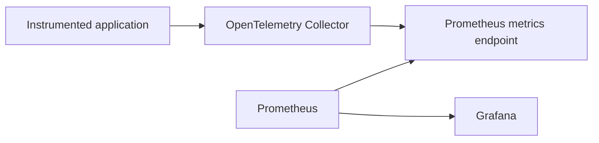

# ADR 0002: Use Prometheus Instead of Grafana Mimir for the Initial Metrics Backend

- **Status:** Accepted
- **Date:** 2026-08-21
- **Decision owners:** Project maintainer
- **Scope:** Initial local and hybrid deployment modes
- **Related decisions:** ADR 0001

---

## Context

The Hybrid Observability Platform requires a local backend for storing and querying application and platform metrics.

The metrics pipeline must support:

- OpenTelemetry-generated application metrics;
- OpenTelemetry Collector internal metrics;
- infrastructure and container metrics;
- PromQL queries;
- Grafana dashboards;
- recording and alerting rules;
- short and explicitly bounded retention;
- reproducible single-workstation deployment;
- controlled CPU, memory, and disk consumption.

Two primary Grafana ecosystem options were evaluated:

- Prometheus;
- Grafana Mimir.

Prometheus is a monitoring and time-series system designed around metric scraping, local storage, PromQL, recording rules, and alerting.

Grafana Mimir is a horizontally scalable, highly available, multi-tenant, long-term storage platform for Prometheus and OpenTelemetry metrics.

Mimir provides capabilities required by larger distributed environments, including:

- horizontal scalability;
- multi-tenancy;
- long-term storage;
- distributed ingestion and querying;
- high availability;
- object-storage integration;
- tenant federation;
- large-scale Prometheus compatibility.

The initial project environment consists of:

- one development workstation;
- one reference application;
- one OpenTelemetry Collector;
- controlled k6 workloads;
- short telemetry retention;
- no multi-tenant requirement;
- no high-availability requirement;
- no long-term metrics requirement.

Using Mimir for this scope would introduce capabilities and operational complexity that are not currently required.

---

## Decision

The project will use **Prometheus** as the initial local metrics backend.

Grafana Mimir will not be included in the initial implementation.

The metrics pipeline will follow this model:



The OpenTelemetry Collector will process application metrics and expose them through a Prometheus-compatible endpoint.

Prometheus will scrape the configured endpoint, store the resulting time series locally, and make them available to Grafana through PromQL.

The initial Prometheus deployment will be:

- single-node;
- locally stored;
- containerized;
- non-multi-tenant;
- configured with bounded retention;
- intended for controlled development and validation workloads.

---

## Decision Drivers

### Scope alignment

The initial platform does not require distributed metric ingestion, multi-tenancy, horizontal scaling, or long-term object storage.

### Operational simplicity

Prometheus can provide the required metrics functionality with fewer services and fewer operational dependencies.

### Resource efficiency

The project must coexist with Docker Desktop, the application, OpenTelemetry Collector, Loki, Tempo, Grafana, and k6 on one development workstation.

### PromQL compatibility

Prometheus provides the native PromQL experience required for dashboards, alerts, recording rules, and operational analysis.

### Portfolio relevance

Prometheus remains widely used across Cloud Operations, DevOps, platform engineering, and SRE environments.

### Reproducibility

A single Prometheus container with version-controlled configuration is easier to deploy, validate, remove, and troubleshoot in the initial project scope.

### Bounded retention

The project requires short-lived telemetry rather than durable long-term metric storage.

### Migration path

Prometheus-compatible remote write and query interfaces provide a future path toward Mimir or another compatible backend if project requirements change.

---

## Initial Deployment Model

The initial metrics topology will contain:

```text
FastAPI application
        |
        | OTLP
        v
OpenTelemetry Collector
        |
        | Prometheus-compatible metrics endpoint
        v
Prometheus
        |
        | PromQL
        v
Grafana
```

Prometheus will remain a storage and query component.

The OpenTelemetry Collector will remain responsible for:

- OTLP reception;
- batching;
- memory limiting;
- resource attributes;
- filtering;
- metric transformation when required;
- exposing metrics in a Prometheus-compatible format.

The application will not depend directly on the Prometheus client as its primary instrumentation contract unless a later requirement justifies an exception.

---

## Retention

The initial Prometheus retention target is:

```text
48 hours
```

This value is intended to provide sufficient data for:

- normal workload baselines;
- controlled load tests;
- latency and error scenarios;
- dashboard validation;
- restart and recovery tests;
- operational evidence collection.

Retention must be configured explicitly.

The implementation must not rely only on Prometheus defaults.

Storage controls should account for:

- time-based retention;
- optional size-based retention;
- scrape interval;
- number of active series;
- metric cardinality;
- histogram configuration;
- workload duration;
- write-ahead log behavior.

The retention target may be revised after actual disk consumption is measured.

---

## Metric Cardinality

Metric cardinality is a primary design constraint.

The implementation must not create unbounded metric labels from:

- user identifiers;
- request IDs;
- trace IDs;
- session IDs;
- complete URLs;
- arbitrary query parameters;
- timestamps;
- exception messages;
- dynamically generated resource names.

Preferred labels should represent bounded operational dimensions such as:

- service name;
- deployment environment;
- HTTP method;
- normalized route;
- response status class;
- instance identifier;
- operation name.

Potentially unbounded attributes should remain in logs or traces rather than metric labels.

---

## Scrape Strategy

Prometheus will scrape only explicitly configured targets.

The initial scrape configuration is expected to include:

- OpenTelemetry Collector application metrics endpoint;
- Prometheus self-monitoring endpoint;
- OpenTelemetry Collector internal metrics;
- additional project components when they expose relevant metrics.

Scrape intervals must balance:

- operational resolution;
- CPU consumption;
- disk consumption;
- time-series volume;
- dashboard requirements.

High-frequency scraping must be justified by a documented use case.

---

## Security Considerations

Prometheus is not intended to be exposed publicly by default.

Prometheus can reveal:

- service names;
- endpoint behavior;
- resource consumption;
- infrastructure metadata;
- internal labels;
- application performance;
- operational failures.

The deployment must apply:

- project-internal container networking;
- no unnecessary host binding;
- restricted access to the Prometheus interface;
- controlled scrape targets;
- sanitized labels;
- no credentials in metrics;
- no sensitive values in annotations;
- reviewed Grafana data-source access.

Prometheus configuration files must not contain embedded cloud credentials or application secrets.

---

## Storage Considerations

Prometheus uses local time-series storage and a write-ahead log.

The implementation must account for:

- persistent Docker volumes;
- write-ahead log growth;
- block compaction;
- temporary disk growth;
- retention enforcement;
- clean shutdown;
- project-specific data removal.

Stopping the Prometheus container does not delete its stored data.

Any cleanup procedure must verify that only project-owned volumes and directories are removed.

Local metrics are considered disposable unless explicitly exported as reviewed project evidence.

---

## Cost Considerations

Local Prometheus storage avoids recurring cloud metrics-storage costs.

The primary local costs are:

- workstation CPU;
- workstation memory;
- local SSD consumption;
- Docker resource allocation;
- operational maintenance.

Prometheus does not prevent AWS charges when hybrid export is enabled.

The OpenTelemetry Collector must independently control any metrics sent to CloudWatch through:

- metric filtering;
- aggregation;
- bounded dimensions;
- controlled export intervals;
- temporary hybrid execution;
- explicit CloudWatch enablement.

Local collection must remain functional when cloud export is disabled.

---

## Alerting Strategy

Prometheus alerting rules may be introduced after the primary metrics pipeline is validated.

Initial alerting scenarios may include:

- application unavailability;
- elevated HTTP error rate;
- excessive P95 latency;
- Collector export failures;
- Prometheus target failure;
- elevated container resource usage;
- telemetry ingestion interruption.

Alertmanager is not required for the first functional pipeline.

Its introduction must be justified by notification-routing or alert-lifecycle requirements and documented through a separate decision if it materially changes the architecture.

---

## Recording Rules

Recording rules may be used for:

- frequently evaluated PromQL expressions;
- latency percentiles;
- service-level indicators;
- request and error rates;
- dashboard query simplification.

Recording rules must:

- use bounded labels;
- follow project naming conventions;
- include clear descriptions;
- be validated automatically;
- avoid unnecessary duplicate series.

---

## Alternatives Considered

### Grafana Mimir in monolithic mode

Mimir can run in monolithic mode, with its required components operating in a single process.

This option was rejected for the initial implementation because the project does not currently require:

- multi-tenancy;
- horizontal scale;
- tenant federation;
- durable long-term storage;
- distributed query processing;
- object-storage integration;
- high-availability ingestion.

Although monolithic mode reduces deployment complexity compared with distributed Mimir, it still introduces concepts and operational behavior beyond the current requirements.

### Grafana Mimir in microservices mode

Distributed Mimir was rejected because it would significantly increase:

- component count;
- configuration complexity;
- resource consumption;
- networking requirements;
- troubleshooting effort;
- storage dependencies;
- operational overhead.

This mode would not be representative of the project’s single-workstation scope.

### VictoriaMetrics

VictoriaMetrics provides an efficient Prometheus-compatible metrics backend with strong compression and single-node deployment options.

It was not selected for the initial implementation because:

- Prometheus provides the simplest reference architecture;
- native Prometheus operation is directly relevant to the current project;
- the project should first establish a baseline before comparing alternative storage engines.

VictoriaMetrics remains a candidate for a future comparative implementation focused on resource and storage efficiency.

### Amazon Managed Service for Prometheus

Amazon Managed Service for Prometheus was not selected because:

- the platform must operate locally without AWS;
- local-first storage is a project requirement;
- managed ingestion would introduce recurring cloud costs;
- the initial workload does not require managed scale or availability.

It may be evaluated in a future AWS-specific deployment.

### CloudWatch as the primary metrics backend

CloudWatch was not selected as the primary backend because:

- it would make the default platform cloud-dependent;
- custom metrics can create recurring charges;
- the project requires a vendor-neutral local mode;
- local PromQL-based exploration remains a core requirement.

CloudWatch remains an optional hybrid destination.

### No persistent metrics backend

The platform could display only short-lived Collector metrics or application output.

This option was rejected because it would not support:

- historical analysis;
- time-window comparisons;
- PromQL;
- dashboards;
- alert evaluation;
- latency and error trends;
- validation of retention behavior.

---

## Consequences

### Positive consequences

- Lower initial architecture complexity.
- Lower expected CPU and memory consumption than a distributed metrics platform.
- Direct PromQL support.
- Strong integration with Grafana.
- Simple local storage model.
- Clear operational baseline.
- High relevance to DevOps and SRE workflows.
- Straightforward containerized deployment.
- Easier troubleshooting.
- Future compatibility with remote-write backends.

### Negative consequences

- No built-in multi-tenancy.
- No high availability.
- No horizontal query scaling.
- No durable long-term object storage.
- Local metrics are unavailable when the workstation is offline.
- Local data can be lost when project volumes are removed.
- Prometheus remains a single point of failure for local metrics.
- Local storage capacity limits the practical retention period.

### Operational risks

- Excessive cardinality may increase memory and disk consumption.
- An aggressive scrape interval may generate unnecessary series volume.
- Misconfigured retention may exhaust local storage.
- Unbounded histograms may create excessive time series.
- Failed scrape targets may create incomplete dashboards.
- Container restarts may reveal configuration or volume problems.
- Large PromQL queries may consume excessive resources.

These risks must be measured and documented during implementation.

---

## Migration Conditions

Grafana Mimir may be reconsidered if one or more of the following requirements emerge:

- multiple independent tenants;
- high-availability metric ingestion;
- horizontal query scaling;
- multiple Prometheus sources;
- long-term object storage;
- retention beyond the practical local Prometheus limit;
- centralized metrics across multiple environments;
- tenant federation;
- production-scale remote write;
- durability requirements that exceed a single workstation.

A migration must be documented through a new ADR.

---

## Migration Path

A future migration may use:

```text
Prometheus
    |
    | remote_write
    v
Grafana Mimir
```

Alternatively, the OpenTelemetry Collector may export metrics to a compatible remote backend.

Before migration, the project must validate:

- label compatibility;
- histogram behavior;
- remote-write queue configuration;
- authentication;
- tenancy headers;
- storage cost;
- query compatibility;
- dashboard behavior;
- alerting responsibility;
- historical data requirements.

Mimir must not be added solely to increase the apparent complexity of the project.

---

## Validation Criteria

This decision will be considered successfully implemented when:

- Prometheus starts from version-controlled configuration;
- the image version is explicitly pinned;
- Prometheus scrapes the intended Collector endpoint;
- Collector internal metrics are available;
- application metrics are stored;
- Grafana can query Prometheus;
- PromQL expressions return expected results;
- metric labels remain bounded;
- retention is configured explicitly;
- retained data survives an ordinary container restart;
- project data can be removed through a reviewed cleanup procedure;
- local mode operates without AWS credentials;
- resource consumption is measured;
- invalid Prometheus configuration is rejected by automated validation.

---

## Reversibility

This decision is reversible.

Prometheus-compatible interfaces and OpenTelemetry instrumentation reduce the cost of replacing or extending the metrics backend.

A replacement must preserve or explicitly migrate:

- metric names;
- resource attributes;
- label conventions;
- PromQL compatibility;
- dashboard queries;
- alerting rules;
- recording rules;
- retention requirements.

Any replacement or addition of Mimir as a required platform component requires a new ADR.

---

## References

- [Prometheus overview](https://prometheus.io/docs/introduction/overview/)
- [Prometheus storage](https://prometheus.io/docs/prometheus/latest/storage/)
- [Prometheus configuration](https://prometheus.io/docs/prometheus/latest/configuration/configuration/)
- [Prometheus instrumentation practices](https://prometheus.io/docs/practices/instrumentation/)
- [Prometheus naming practices](https://prometheus.io/docs/practices/naming/)
- [OpenTelemetry Collector Prometheus exporter](https://github.com/open-telemetry/opentelemetry-collector-contrib/tree/main/exporter/prometheusexporter)
- [Grafana Mimir documentation](https://grafana.com/docs/mimir/latest/)
- [Grafana Mimir deployment modes](https://grafana.com/docs/mimir/latest/references/architecture/deployment-modes/)
- [VictoriaMetrics single-node documentation](https://docs.victoriametrics.com/victoriametrics/single-server-victoriametrics/)
- [Amazon Managed Service for Prometheus](https://docs.aws.amazon.com/prometheus/latest/userguide/what-is-Amazon-Managed-Service-Prometheus.html)
