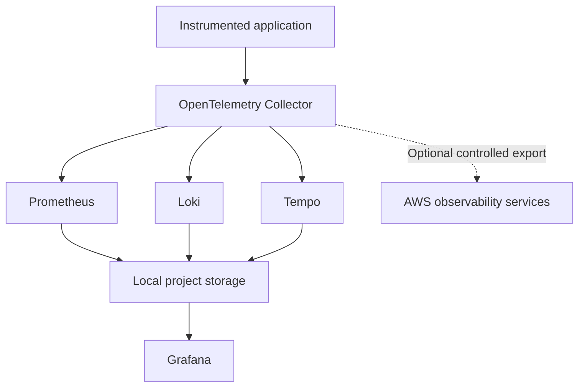

# ADR 0003: Store Primary Telemetry Locally

- **Status:** Accepted
- **Date:** 2026-08-21
- **Decision owners:** Project maintainer
- **Scope:** Initial local and hybrid deployment modes
- **Related decisions:** ADR 0001, ADR 0002

---

## Context

The Hybrid Observability Platform collects and correlates:

- application metrics;
- infrastructure metrics;
- application logs;
- Collector internal telemetry;
- distributed traces;
- controlled load-test telemetry.

These signals can generate continuous storage consumption even in a small development environment.

Using cloud services as the primary telemetry backends would introduce:

- recurring ingestion charges;
- storage charges;
- query charges;
- data-transfer considerations;
- cloud-provider dependency;
- credential requirements;
- accidental cost-amplification risk;
- cleanup and retention obligations.

The project requires a storage model that:

- supports metrics, logs, and traces;
- remains available without cloud credentials;
- minimizes recurring cloud costs;
- allows controlled retention;
- can be deployed and removed reproducibly;
- supports realistic Grafana dashboards;
- preserves the computer laboratory for TCC2 and subsequent projects;
- prevents laboratory telemetry from becoming permanent data;
- provides an optional path to cloud observability services.

The development workstation currently provides sufficient resources for the initial single-node environment.

The dedicated laboratory computer is reserved for:

- TCC2 implementation;
- persistent Linux experiments;
- heavier observability environments;
- later infrastructure and distributed-system projects;
- project scenarios requiring dedicated hardware.

The Fiverr and portfolio observability environment must not introduce unnecessary dependencies or data into the dedicated TCC2 laboratory system.

---

## Decision

The project will store its primary telemetry locally on the development workstation.

The development workstation will host:

- Prometheus metric data;
- Loki log data;
- Tempo trace data;
- Grafana runtime state;
- OpenTelemetry Collector runtime data when required.

The dedicated TCC2 laboratory computer will not be used as the initial storage backend.

AWS observability services will remain optional and will not be the authoritative telemetry store for the initial implementation.

The storage model is:



Local telemetry is considered:

- temporary;
- reproducible;
- bounded;
- non-authoritative outside the project;
- removable after validation.

Source code, configuration, dashboards, rules, and documentation remain version-controlled. Runtime telemetry does not.

---

## Decision Drivers

### Cost control

Local storage avoids continuous CloudWatch, X-Ray, managed Prometheus, managed Grafana, or third-party SaaS ingestion and retention charges.

### Environment isolation

The portfolio project must remain independent from the dedicated TCC2 laboratory environment.

### Reproducibility

The telemetry environment must be recreatable from version-controlled configuration.

### Controlled lifecycle

Telemetry must be removable without deleting source code, dashboards, infrastructure definitions, or documentation.

### Offline operation

The primary observability pipeline must remain functional without AWS access or internet connectivity after required container images are available locally.

### Storage transparency

The project must define where data is stored, how long it is retained, and how it is removed.

### Vendor neutrality

The default storage model must not require a commercial observability platform.

### Operational realism

The platform still needs persistent storage across ordinary container restarts so that retention, historical analysis, and recovery behavior can be evaluated.

---

## Data Classification

The local telemetry generated by this project is classified as development and validation data.

It may contain:

- application route names;
- response status codes;
- latency measurements;
- exception types;
- service and container identifiers;
- local host metadata;
- synthetic request information;
- trace and span identifiers.

The project must not intentionally collect:

- passwords;
- access keys;
- authentication tokens;
- session cookies;
- private keys;
- payment information;
- unnecessary personal data;
- production customer information;
- third-party confidential telemetry.

If sensitive information is detected, it must be removed at the earliest practical stage of the pipeline and treated according to the security policy.

---

## Storage Location

Runtime telemetry will use project-specific Docker storage on the development workstation.

The initial implementation may use Docker named volumes for:

- Prometheus;
- Loki;
- Tempo;
- Grafana.

Example logical volume names include:

```text
hybrid-observability-prometheus-data
hybrid-observability-loki-data
hybrid-observability-tempo-data
hybrid-observability-grafana-data
```

Actual Compose-generated names must remain identifiable as belonging to this project.

The implementation must not use generic volume names such as:

```text
data
storage
database
volume
```

Generic names increase the risk of confusing project-owned data with data from unrelated environments.

Project storage must not be placed inside:

- the Git repository history;
- tracked configuration directories;
- shared credential directories;
- the dedicated TCC2 project storage;
- unrelated Docker project volumes.

---

## Version-Control Boundary

The following artifacts must be committed:

- Prometheus configuration;
- Loki configuration;
- Tempo configuration;
- Grafana provisioning;
- Grafana dashboard definitions;
- OpenTelemetry Collector configuration;
- alert and recording rules;
- retention configuration;
- Compose definitions;
- validation scripts;
- cleanup scripts;
- storage documentation.

The following artifacts must not be committed:

- Prometheus time-series blocks;
- Prometheus write-ahead logs;
- Loki chunks and indexes;
- Tempo trace blocks;
- Grafana runtime databases;
- container runtime logs;
- local telemetry exports;
- Docker volume contents;
- transient test evidence;
- credentials or secrets.

The repository `.gitignore` establishes the initial enforcement boundary.

---

## Persistence Model

Runtime telemetry must persist across:

- an ordinary container restart;
- a controlled `docker compose stop`;
- a controlled `docker compose down` without volume removal;
- application restarts;
- Collector restarts.

Runtime telemetry may be removed during an explicit project cleanup operation.

This distinction is required:

| Operation | Expected data behavior |
|---|---|
| Restart a service | Data preserved |
| Stop the stack | Data preserved |
| Start the stack again | Existing retained data available |
| Remove containers without volumes | Data preserved |
| Execute reviewed full cleanup | Project telemetry removed |
| Delete source repository | Runtime volumes handled separately |

Container removal must not be assumed to remove stored telemetry.

---

## Initial Retention Baseline

The initial retention targets are:

| Backend | Initial target |
|---|---:|
| Prometheus | 48 hours |
| Loki | 24 hours |
| Tempo | 24 hours |
| Grafana runtime state | Persistent for the project lifecycle |
| Local workload results | Removed after validation unless intentionally documented |

These values are starting constraints rather than permanent guarantees.

Retention may be adjusted after measuring:

- ingestion volume;
- active time series;
- metric cardinality;
- log volume;
- trace volume;
- compression behavior;
- Docker disk consumption;
- query requirements;
- workload duration.

Any material retention change must be documented.

---

## Storage Guardrails

The implementation must apply controls at multiple layers.

### Metrics

Prometheus controls must include:

- time-based retention;
- optional size-based retention;
- bounded scrape intervals;
- bounded metric labels;
- controlled histogram configuration;
- reviewed recording rules.

### Logs

Loki controls must include:

- explicitly enabled retention;
- bounded log levels;
- limited high-cardinality labels;
- controlled structured metadata;
- filtering of unnecessary log events;
- compactor behavior appropriate to the selected storage mode.

Loki retention must not be assumed to be active by default.

### Traces

Tempo controls must include:

- trace sampling;
- explicit retention;
- bounded workload duration;
- attribute filtering;
- local storage configuration;
- controlled metrics generation from traces.

### Collector

OpenTelemetry Collector controls must include:

- memory limiting;
- batch processing;
- bounded queues;
- retry controls;
- filtering;
- sampling where applicable;
- observable dropped-data behavior.

### Workload generation

k6 controls must include:

- bounded duration;
- bounded virtual users;
- bounded request rate;
- test abort thresholds;
- explicit target validation.

---

## Local Resource Budget

The initial platform must operate within a documented workstation resource budget.

The first implementation must measure:

- total Docker memory consumption;
- CPU consumption at idle;
- CPU consumption under controlled load;
- disk consumption per signal;
- ingestion rate;
- active time-series count;
- log volume per minute;
- spans per request;
- cleanup effectiveness.

Initial resource limits will be established during implementation rather than invented before measurement.

The environment must fail visibly if local resource constraints prevent safe operation.

It must not silently consume unrestricted workstation resources.

---

## Disk-Space Protection

Local telemetry storage can exhaust the Docker virtual disk or the host SSD even when individual containers remain healthy.

The project must therefore provide procedures to:

- inspect project volume sizes;
- inspect Docker disk usage;
- identify the largest telemetry backend;
- verify retention execution;
- stop workload generation;
- stop ingestion safely;
- remove only project-owned telemetry;
- confirm reclaimed storage.

Cleanup commands must use explicit project identifiers.

Broad destructive commands such as removing all Docker volumes are outside the project operating procedure.

---

## Backup and Recovery

Runtime telemetry will not be backed up by default.

The project treats local telemetry as reproducible validation data rather than business records.

The following artifacts provide recovery capability:

- version-controlled configuration;
- version-controlled dashboards;
- version-controlled rules;
- reproducible workloads;
- application source code;
- deployment automation;
- validation procedures.

If a telemetry dataset is intentionally preserved for analysis, it must be:

- reviewed for sensitive information;
- documented;
- stored outside the live backend;
- excluded from Git unless explicitly approved;
- assigned a defined retention period.

Loss of local runtime telemetry is acceptable within the initial project scope.

---

## Security Considerations

Local storage reduces external data exposure but does not eliminate security risk.

Local telemetry can disclose:

- application behavior;
- internal service names;
- local filesystem information;
- container identifiers;
- network details;
- exception messages;
- trace attributes;
- system resource consumption.

The implementation must apply:

- restricted access to backend interfaces;
- no public exposure by default;
- sanitized telemetry attributes;
- no secrets in logs, metrics, or traces;
- project-specific storage;
- reviewed screenshots;
- controlled data deletion;
- protection of the Docker environment;
- limited access to the development workstation.

Local storage must not be described as encrypted unless encryption has been explicitly configured and validated.

---

## Privacy Considerations

Synthetic data should be used whenever user-like or transaction-like information is required.

The project must not use:

- real customer records;
- real credentials;
- private communications;
- personal browsing activity;
- production application traffic;
- third-party operational data without authorization.

Telemetry examples must use intentionally generated identifiers and payloads.

---

## Cost Considerations

Local storage shifts the primary cost model from cloud billing to workstation resources.

Local costs include:

- SSD consumption;
- memory allocation;
- CPU utilization;
- electricity;
- Docker disk growth;
- operational maintenance.

These costs are bounded through retention, sampling, workload limits, and cleanup.

Optional AWS export remains subject to:

- metric ingestion and storage charges;
- log ingestion and storage charges;
- trace ingestion charges;
- query charges;
- data-transfer charges where applicable;
- resource costs created by Terraform.

No cloud component should be described as free without verifying the applicable account, region, service, and usage limits.

---

## Hybrid Export

Hybrid mode may duplicate a controlled subset of local telemetry in AWS.

Hybrid export must be:

- disabled by default;
- explicitly enabled;
- time-bounded;
- volume-bounded;
- separately configurable;
- independently removable;
- validated for cost impact.

The expected model is:

```text
Local backends: primary telemetry storage
AWS backends: temporary integration evidence
```

Enabling or disabling AWS export must not require changes to application instrumentation.

---

## Alternatives Considered

### Store all telemetry in Amazon CloudWatch and AWS X-Ray

This option was rejected as the default because it would:

- introduce recurring charges;
- require AWS credentials;
- couple routine development to AWS availability;
- increase the risk of forgotten retention;
- reduce the value of the local open-source stack;
- make repeated workload testing more expensive.

CloudWatch and X-Ray remain optional hybrid destinations.

### Store telemetry on the dedicated laboratory computer

This option was rejected for the initial implementation because the dedicated computer is reserved for TCC2 and subsequent persistent laboratory environments.

Using it now would:

- mix unrelated project data;
- complicate TCC2 preparation;
- create additional network dependencies;
- require longer-lived service configuration;
- make project cleanup less isolated.

The laboratory computer may be reconsidered through a future ADR when a dedicated multi-host scenario is required.

### Store telemetry only in memory

This option was rejected because it would not support:

- restart validation;
- historical dashboard analysis;
- retention testing;
- controlled recovery scenarios;
- persistence across ordinary service interruptions.

In-memory storage may be used only for isolated component experiments.

### Use a managed Grafana Cloud stack

This option was rejected as the default because:

- the project requires local-first operation;
- managed ingestion creates an external dependency;
- usage limits and pricing may change;
- the project intends to demonstrate backend operation and retention controls.

Grafana Cloud may be evaluated later as an external comparison.

### Use SigNoz with ClickHouse

This option was not selected for the initial implementation because:

- it introduces ClickHouse and additional platform components;
- it requires a different operational model;
- the initial project is centered on the Grafana OSS ecosystem;
- the development workstation uses Windows and Docker-based tooling;
- the project should establish a baseline before comparing integrated platforms.

SigNoz remains a candidate for a future comparative implementation.

### Use VictoriaMetrics, VictoriaLogs, and VictoriaTraces

This stack offers efficient single-node telemetry storage and native OpenTelemetry integration.

It was not selected initially because:

- the project already requires direct experience with Prometheus, Loki, and Tempo;
- the Grafana OSS stack is more aligned with the initial portfolio objective;
- alternative storage efficiency should be measured against an established baseline.

A future comparison may evaluate resource and storage efficiency.

### Use Grafana Mimir for metrics

Mimir was rejected for the initial metrics backend in ADR 0002 because the current environment does not require multi-tenancy, distributed scaling, high availability, or long-term object storage.

---

## Consequences

### Positive consequences

- Minimal recurring cloud observability costs.
- Local operation without AWS credentials.
- Clear separation from the TCC2 laboratory computer.
- Full control over retention and cleanup.
- Reproducible telemetry generation.
- Realistic Grafana dashboards using actual signals.
- Direct operational experience with open-source backends.
- Reduced cloud-provider dependency.
- Ability to test offline after images are available.

### Negative consequences

- The development workstation becomes the initial storage host.
- Telemetry is unavailable when the workstation is offline.
- No high availability.
- No default backup.
- Docker storage requires active monitoring.
- Local SSD capacity limits retention.
- Local resource contention may affect measurements.
- Removing project volumes permanently deletes telemetry.
- Workstation performance results cannot be generalized to production.

### Operational risks

- Docker volumes may continue consuming disk after containers are removed.
- Retention misconfiguration may allow uncontrolled growth.
- Excessive telemetry may fill the Docker virtual disk.
- High cardinality may increase memory and storage consumption.
- Debug logging may generate excessive Loki data.
- Unsampled traces may increase Tempo storage rapidly.
- Cleanup commands may target unrelated data if project ownership is unclear.

These risks must be addressed through naming, validation, resource limits, retention, and reviewed cleanup procedures.

---

## Migration Conditions

Local storage may be reconsidered if one or more of the following requirements emerge:

- multi-host telemetry collection;
- continuous operation independent of the workstation;
- long-term retention;
- durable backup;
- high availability;
- shared access by multiple users;
- production workloads;
- storage exceeding workstation capacity;
- centralized telemetry across environments;
- formal recovery requirements.

A migration must be documented through a new ADR.

---

## Migration Options

Future storage destinations may include:

- Grafana Mimir;
- Grafana Cloud;
- Amazon Managed Service for Prometheus;
- Amazon CloudWatch;
- object-storage-backed Loki and Tempo;
- VictoriaMetrics ecosystem components;
- SigNoz and ClickHouse;
- dedicated laboratory hardware;
- Kubernetes-hosted observability backends.

Migration must preserve or explicitly transform:

- metric names and labels;
- log attributes and structured metadata;
- trace resource attributes;
- service identifiers;
- retention requirements;
- Grafana data sources;
- dashboard queries;
- alerting rules;
- security controls.

---

## Validation Criteria

This decision will be considered successfully implemented when:

- Prometheus persists data locally;
- Loki persists data locally;
- Tempo persists data locally;
- Grafana state persists locally;
- data survives an ordinary container restart;
- retention is explicitly configured;
- Docker volumes are clearly project-owned;
- telemetry directories and volumes are excluded from Git;
- disk consumption can be measured;
- application telemetry can be recreated;
- local mode works without AWS credentials;
- the dedicated TCC2 laboratory computer is not required;
- project-only cleanup can be executed safely;
- cleanup removes runtime telemetry without removing source code;
- AWS export remains optional.

---

## Reversibility

This decision is reversible.

OpenTelemetry provides a stable application-to-Collector contract, allowing telemetry storage destinations to change without requiring a complete application instrumentation redesign.

Any change that makes an external or cloud backend the primary telemetry store requires a new ADR.

---

## References

- [OpenTelemetry Collector](https://opentelemetry.io/docs/collector/)
- [Prometheus storage](https://prometheus.io/docs/prometheus/latest/storage/)
- [Grafana Loki storage](https://grafana.com/docs/loki/latest/configure/storage/)
- [Grafana Loki retention](https://grafana.com/docs/loki/latest/operations/storage/retention/)
- [Grafana Tempo configuration](https://grafana.com/docs/tempo/latest/configuration/)
- [Docker volumes](https://docs.docker.com/engine/storage/volumes/)
- [Amazon CloudWatch billing and cost](https://docs.aws.amazon.com/AmazonCloudWatch/latest/monitoring/cloudwatch_billing.html)
- [VictoriaMetrics OpenTelemetry integration](https://docs.victoriametrics.com/opentelemetry/)
- [SigNoz self-hosted deployment](https://signoz.io/docs/install/docker/)
