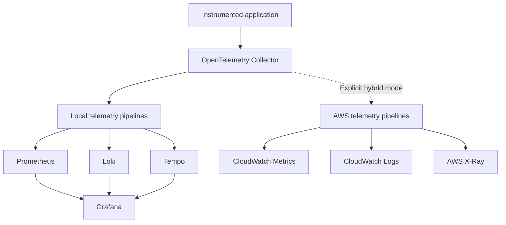

# ADR 0004: Make AWS Telemetry Export Optional and Disabled by Default

- **Status:** Accepted
- **Date:** 2026-08-21
- **Decision owners:** Project maintainer
- **Scope:** Hybrid deployment mode
- **Related decisions:** ADR 0001, ADR 0002, ADR 0003

---

## Context

The Hybrid Observability Platform must demonstrate integration with AWS observability services while preserving a local-first and vendor-neutral architecture.

The primary local telemetry backends are:

- Prometheus for metrics;
- Loki for logs;
- Tempo for traces;
- Grafana for visualization and correlation.

The platform may also integrate with:

- Amazon CloudWatch Metrics;
- CloudWatch Logs;
- AWS X-Ray;
- CloudWatch Application Signals where technically appropriate.

AWS integration provides relevant experience for:

- Cloud Operations;
- DevOps;
- Site Reliability Engineering;
- AWS infrastructure management;
- telemetry routing;
- cloud cost control;
- hybrid observability;
- Terraform-based deployment.

However, continuously exporting all locally generated telemetry to AWS would introduce risks and requirements that are unnecessary for the default development workflow.

These include:

- custom metric charges;
- log ingestion and retention charges;
- trace ingestion charges;
- query charges;
- data-transfer considerations;
- credential requirements;
- cloud-provider dependency;
- duplicated storage;
- excessive telemetry cardinality;
- forgotten resources;
- unintended long-running workloads;
- accidental cost amplification.

The project requires AWS integration to be real and reproducible without making AWS the mandatory or permanent telemetry backend.

---

## Decision

AWS telemetry export will be:

- optional;
- disabled by default;
- explicitly enabled;
- time-bounded;
- volume-bounded;
- independently configurable;
- independently removable.

The local observability stack will remain the primary telemetry destination.

The default mode will be:

```text
local
```

An explicit hybrid mode will enable selected AWS destinations:

```text
hybrid
```

The conceptual model is:



Local mode must operate without:

- AWS credentials;
- an AWS account;
- AWS network connectivity;
- CloudWatch resources;
- X-Ray resources;
- AWS-specific application instrumentation.

Enabling or disabling hybrid mode must not require changes to the application source code or its OpenTelemetry instrumentation contract.

---

## Primary Storage Responsibility

The authoritative project telemetry remains local.

| Signal | Primary destination | Optional AWS destination |
|---|---|---|
| Metrics | Prometheus | CloudWatch Metrics |
| Logs | Loki | CloudWatch Logs |
| Traces | Tempo | AWS X-Ray |
| Visualization | Grafana | AWS service interfaces and optional Grafana AWS data sources |

AWS destinations are intended for:

- integration validation;
- cloud operational evidence;
- Terraform validation;
- dashboard comparison;
- cost measurement;
- short portfolio demonstration windows;
- failure and recovery testing.

AWS destinations are not intended to provide permanent duplication of all project telemetry.

---

## Decision Drivers

### Cost control

Cloud observability expenditure must be deliberate and measurable.

### Local independence

The platform must remain functional when AWS is unavailable or intentionally disabled.

### Vendor-neutral instrumentation

The application must continue using OpenTelemetry rather than AWS-specific telemetry APIs as its primary contract.

### Portfolio relevance

The project should demonstrate authentic CloudWatch and X-Ray integration rather than simulated screenshots or conceptual configuration.

### Reproducibility

Hybrid export must be enabled through version-controlled configuration and documented procedures.

### Separation of concerns

Application instrumentation, telemetry processing, local storage, and AWS export must remain independently configurable.

### Safe experimentation

AWS validation must use controlled telemetry volume, bounded workloads, short retention, and explicit resource cleanup.

### Failure isolation

An unavailable AWS destination must not make the local observability pipeline unusable.

---

## Operating Modes

### Local mode

Local mode is the default operating state.

Expected behavior:

- telemetry is exported to Prometheus, Loki, and Tempo;
- Grafana queries local data sources;
- no AWS credentials are required;
- no project telemetry is sent to AWS;
- no CloudWatch or X-Ray resources are required;
- AWS exporter configuration is inactive.

The local mode must be suitable for routine development, testing, dashboard construction, and controlled load generation.

### Hybrid mode

Hybrid mode extends the local pipeline with selected AWS destinations.

Expected behavior:

- local telemetry continues to operate;
- AWS export is explicitly enabled;
- only approved telemetry is exported;
- sampling and filtering are applied;
- AWS retention is short;
- workload duration is bounded;
- cloud resources are inventoried;
- costs are reviewed;
- AWS resources are removed after validation when no longer required.

Hybrid mode must not silently become active because AWS credentials are present on the workstation.

Possession of credentials is not equivalent to authorization to export telemetry.

---

## Configuration Contract

The implementation will provide an explicit operating-mode contract.

The exact mechanism may use:

- Compose profiles;
- environment-specific Collector configuration;
- generated configuration;
- explicitly selected deployment files;
- a validated environment variable.

A representative interface is:

```text
OBSERVABILITY_MODE=local
```

or:

```text
OBSERVABILITY_MODE=hybrid
```

The final implementation must reject unknown values.

The project must not use ambiguous flags such as:

```text
ENABLE_CLOUD=true
```

without documenting:

- which provider;
- which signals;
- which region;
- which account context;
- which resources;
- which retention policy.

Hybrid configuration must identify its active destinations explicitly.

---

## AWS Region

The initial AWS demonstration environment will default to:

```text
us-east-1
```

The region must remain configurable.

AWS resources, exporters, dashboards, logs, traces, alarms, and validation commands must use the same explicitly selected region unless a documented exception applies.

Billing metrics and global AWS billing alerts may have region-specific behavior and must be treated separately from project telemetry.

---

## AWS Authentication

Hybrid mode must prefer temporary and role-based authentication.

Approved patterns include:

- AWS IAM Identity Center sessions;
- AWS CLI profiles backed by temporary sessions;
- IAM roles attached to AWS compute resources;
- workload identity mechanisms supported by the selected runtime.

The project must not require committed or hard-coded:

- AWS access key IDs;
- AWS secret access keys;
- session tokens;
- account identifiers;
- role credentials.

Environment variables may reference an authenticated local session but must not be committed with credential values.

The local mode must never fail because an AWS session has expired.

---

## IAM Requirements

AWS permissions must follow least-privilege principles.

Permissions must be limited to the operations required for the enabled telemetry signals.

Potential permission categories include:

- publishing selected custom metrics;
- creating or writing to approved log groups and streams;
- publishing traces;
- reading project dashboards or metrics during validation;
- describing project-owned resources.

The final IAM policy must be derived from the selected export mechanism.

Broad policies such as the following must not be used as the permanent project configuration:

```text
AdministratorAccess
CloudWatchFullAccess
AWSXRayFullAccess
```

Temporary experimentation with broad permissions is not considered a valid completed implementation.

---

## Metrics Export

CloudWatch custom metrics must be treated as a cost-sensitive destination.

Metric export controls must include:

- explicit metric allowlists;
- bounded dimensions;
- standard resolution unless a documented scenario requires otherwise;
- controlled export intervals;
- no trace IDs or request IDs as metric dimensions;
- no raw URL values;
- no user identifiers;
- no dynamically generated unbounded labels;
- no duplicate publication paths.

The initial hybrid implementation should export only metrics necessary to demonstrate the integration.

Candidate metrics include:

- request count;
- error count or error rate;
- request latency;
- application availability;
- selected service health metrics.

Host metrics already provided by AWS services must not be duplicated as custom metrics without a documented reason.

---

## Logs Export

CloudWatch Logs export must use project-specific log groups.

Log groups must define:

- a clear naming convention;
- explicit retention;
- ownership tags where supported;
- expected log source;
- expected environment;
- cleanup responsibility.

The initial retention target is:

```text
1 day
```

Logs must be filtered before export to avoid:

- debug noise;
- health-check repetition;
- credentials;
- authorization headers;
- session tokens;
- request and response bodies containing sensitive data;
- unnecessary stack traces;
- high-volume duplicate events.

A log group must not be assumed deleted merely because the application, Collector, or EC2 resource was removed.

---

## Trace Export

Trace export to AWS X-Ray must use controlled sampling.

The implementation must avoid exporting every span from high-volume workload tests unless that behavior is explicitly required and cost-reviewed.

Trace controls must include:

- head or tail sampling as selected by implementation;
- service-name normalization;
- removal of sensitive attributes;
- bounded test duration;
- exclusion or reduced sampling of repetitive health checks;
- validation of trace-context propagation;
- explicit AWS destination configuration.

Local Tempo traces remain available for full-stack local validation.

AWS traces provide integration evidence and comparison rather than permanent trace storage.

---

## Application Signals

CloudWatch Application Signals may be evaluated if it provides useful service-level visibility for the selected application and deployment model.

It is not a mandatory initial component.

Before enabling Application Signals, the project must review:

- supported runtime and instrumentation;
- required permissions;
- generated metric volume;
- generated trace volume;
- service and operation cardinality;
- retention;
- pricing implications;
- overlap with existing local telemetry.

Adding Application Signals as a required component may require a separate ADR.

---

## Collector Export Strategy

The OpenTelemetry Collector remains the central telemetry processing layer.

AWS export may use:

- supported AWS exporters;
- supported AWS OTLP endpoints;
- an AWS-supported OpenTelemetry distribution;
- another documented and compatible AWS integration.

The specific transport and exporter selection will be validated during implementation.

Selection criteria include:

- upstream support status;
- compatibility with the selected Collector version;
- AWS documentation;
- authentication model;
- signal support;
- retry behavior;
- queue behavior;
- failure isolation;
- maintenance status;
- cost implications.

Deprecated exporters or unsupported integration paths must not be used merely because older examples remain available online.

---

## Failure Isolation

AWS exporter failure must not make local telemetry unavailable.

The implementation must account for:

- expired AWS sessions;
- denied IAM permissions;
- unavailable AWS endpoints;
- invalid regions;
- service throttling;
- network failure;
- retry exhaustion;
- queue saturation;
- malformed AWS configuration.

Local and AWS export paths must be isolated sufficiently to prevent prolonged AWS failures from exhausting Collector memory or blocking local delivery.

The implementation may require:

- separate pipelines;
- separate queues;
- bounded retries;
- bounded queue sizes;
- explicit timeout settings;
- connectors or routing components;
- AWS-specific Collector instances if isolation cannot be achieved safely in one process.

The chosen isolation mechanism must be validated through failure testing.

---

## Cost Guardrails

Hybrid mode must apply cost guardrails before AWS export begins.

### Required controls

- verify the active AWS account context;
- verify the selected region;
- estimate the expected resource cost;
- define the execution window;
- define workload limits;
- define exported signals;
- define log retention;
- define trace sampling;
- define metric dimensions;
- tag project resources;
- record deployment time;
- record cleanup time;
- verify post-destroy inventory.

### Prohibited defaults

Hybrid mode must not default to:

- unlimited log retention;
- high-resolution custom metrics;
- unrestricted trace sampling;
- unbounded load generation;
- VPC Flow Logs for all traffic;
- continuous debug logging;
- automatic permanent CloudWatch export;
- high-cardinality custom dimensions;
- deployment without resource tags.

---

## Resource Tagging

Project-created AWS resources should use consistent tags where supported.

The initial tag model should include:

| Tag | Purpose |
|---|---|
| `Project` | Identify the Hybrid Observability Platform |
| `Environment` | Identify the demonstration environment |
| `ManagedBy` | Identify Terraform ownership |
| `Purpose` | Identify observability validation |
| `CostControl` | Identify temporary or bounded resources |

Exact values will be defined in the Terraform implementation.

Tagging does not replace resource inventory or cleanup verification.

---

## Terraform Responsibility

Terraform will provision AWS resources required by the hybrid demonstration environment.

Terraform must define:

- resource names;
- tags;
- IAM roles and policies;
- log groups and retention;
- dashboards and alarms where applicable;
- AWS compute resources where applicable;
- outputs required for validation.

Terraform must not embed credentials.

A successful `terraform destroy` is necessary but not sufficient evidence of complete cleanup.

Post-destroy validation must check for resources that may remain outside the Terraform dependency graph or that were created dynamically by AWS services.

---

## Telemetry Duplication

Hybrid mode duplicates selected telemetry.

Duplication can produce:

- different aggregation behavior;
- different timestamps;
- different attribute mappings;
- different retention;
- different query semantics;
- different sampling results;
- different cost profiles.

The project must not assume that local and AWS values will be byte-for-byte or event-for-event identical.

Validation should focus on:

- signal presence;
- service identity;
- expected trends;
- expected errors;
- expected latency behavior;
- trace propagation;
- documented transformation differences.

---

## Data Governance

Only synthetic or project-owned telemetry may be exported to AWS.

Hybrid mode must not export:

- third-party production data;
- real customer information;
- private communications;
- unrelated workstation logs;
- browser activity;
- local personal files;
- credentials;
- unnecessary account information.

The project must document which signals and attributes are permitted to leave the local environment.

---

## Security Considerations

Hybrid export expands the platform’s trust boundary.

The implementation must account for:

- AWS credential exposure;
- telemetry exfiltration;
- excessive permissions;
- public ingestion endpoints;
- sensitive attributes;
- cross-account mistakes;
- incorrect region selection;
- persistent cloud resources;
- insecure transport;
- compromised Collector configuration.

Required controls include:

- temporary authentication;
- least-privilege IAM;
- encrypted transport;
- explicit account and region verification;
- reviewed exporter destinations;
- sensitive-attribute filtering;
- no secrets in configuration;
- no public OTLP exposure by default;
- sanitized evidence;
- post-deployment audit.

---

## Alternatives Considered

### Always export all telemetry to AWS

This option was rejected because it would:

- create recurring charges;
- make local development dependent on AWS;
- unnecessarily duplicate telemetry;
- increase credential exposure;
- complicate routine load testing;
- undermine the local-first architecture.

### Use CloudWatch as the primary backend

This option was rejected because the platform requires:

- local Prometheus and PromQL;
- local Loki and LogQL;
- local Tempo and trace exploration;
- vendor-neutral operation;
- cloud-independent development.

CloudWatch remains an optional integration destination.

### Remove AWS integration entirely

This option was rejected because authentic AWS integration provides significant value for:

- Cloud Operations roles;
- DevOps and SRE portfolios;
- Terraform experience;
- CloudWatch operations;
- AWS cost-control practice;
- hybrid observability validation.

### Send telemetry directly from the application to AWS

This option was rejected as the primary approach because it would:

- couple the application to AWS;
- create multiple instrumentation paths;
- reduce central filtering;
- complicate local operation;
- make backend replacement more difficult.

### Use Amazon Managed Grafana

Amazon Managed Grafana was not selected for the initial implementation because:

- local Grafana already satisfies the visualization requirement;
- managed access introduces additional configuration and cost;
- the platform must remain functional without AWS;
- managed Grafana would not eliminate the need to control telemetry storage.

It may be evaluated later through a separate decision.

### Use AWS Distro for OpenTelemetry everywhere

This option was not selected as the universal Collector distribution because the default environment is local and vendor-neutral.

AWS Distro for OpenTelemetry remains a candidate for an AWS-specific deployment if it provides a documented compatibility or operational advantage.

---

## Consequences

### Positive consequences

- Routine development does not incur AWS telemetry charges.
- The platform operates without AWS credentials.
- AWS integration remains real and demonstrable.
- The application instrumentation remains vendor-neutral.
- Cloud export can be enabled without application changes.
- Local dashboards remain available during AWS failure.
- AWS cost controls become explicit engineering requirements.
- Cloud resources can be created and removed through Terraform.
- Hybrid behavior can be evaluated independently.

### Negative consequences

- Two operating modes require additional configuration.
- Hybrid mode creates duplicate telemetry paths.
- AWS and local backends may represent telemetry differently.
- AWS exporter configuration requires maintenance.
- Failure isolation increases Collector configuration complexity.
- Hybrid validation requires active AWS authentication.
- Cost and cleanup procedures require continuous review.
- Screenshots and evidence require sanitization.

### Operational risks

- Hybrid mode may remain enabled longer than intended.
- AWS retries may consume Collector resources.
- Log groups may remain after compute resources are removed.
- High-cardinality metrics may generate unexpected charges.
- Unsampled traces may increase ingestion costs.
- Expired sessions may create exporter failures.
- Incorrect account context may deploy resources to the wrong account.
- Incorrect region selection may obscure resources during cleanup.
- A successful local pipeline may hide AWS export failure.

These risks must be covered by automated and manual validation.

---

## Validation Criteria

This decision will be considered successfully implemented when:

- local mode starts without AWS credentials;
- local metrics, logs, and traces remain functional;
- hybrid mode requires explicit activation;
- unknown operating modes are rejected;
- AWS account and region are verified before deployment;
- AWS permissions follow least privilege;
- selected metrics appear in CloudWatch;
- selected logs appear in the intended log group;
- selected traces appear in X-Ray;
- log retention is explicitly configured;
- trace sampling is active;
- metric dimensions remain bounded;
- AWS failure does not stop local telemetry delivery;
- hybrid execution is time-bounded;
- Terraform removes managed AWS resources;
- post-destroy checks confirm cleanup;
- AWS export can be disabled without application-code changes;
- hybrid cost evidence is recorded.

---

## Migration Conditions

AWS export may become a primary telemetry path only if future requirements include:

- production AWS workloads;
- centralized cloud operations;
- continuous managed monitoring;
- multi-user access;
- cloud-based alerting requirements;
- durability beyond the local workstation;
- formal AWS operational ownership.

Such a change would materially alter the project architecture and requires a new ADR.

---

## Reversibility

This decision is reversible.

The OpenTelemetry application contract and Collector routing model allow AWS exporters to be:

- added;
- changed;
- disabled;
- replaced;
- isolated in a separate Collector.

Making AWS export mandatory or replacing local storage as the primary destination requires a new ADR.

---

## References

- [Amazon CloudWatch OpenTelemetry documentation](https://docs.aws.amazon.com/AmazonCloudWatch/latest/monitoring/CloudWatch-OpenTelemetry-Sections.html)
- [Collect metrics and traces with OpenTelemetry](https://docs.aws.amazon.com/AmazonCloudWatch/latest/monitoring/CloudWatch-Agent-OpenTelemetry-metrics.html)
- [Amazon CloudWatch Logs billing](https://docs.aws.amazon.com/AmazonCloudWatch/latest/logs/LogsBillingDetails.html)
- [Analyzing and reducing CloudWatch costs](https://docs.aws.amazon.com/AmazonCloudWatch/latest/monitoring/cloudwatch_billing.html)
- [Publishing custom CloudWatch metrics](https://docs.aws.amazon.com/AmazonCloudWatch/latest/monitoring/publishingMetrics.html)
- [AWS X-Ray documentation](https://docs.aws.amazon.com/xray/latest/devguide/aws-xray.html)
- [AWS Distro for OpenTelemetry](https://aws-otel.github.io/)
- [OpenTelemetry Collector](https://opentelemetry.io/docs/collector/)
- [Grafana CloudWatch data source](https://grafana.com/docs/grafana/latest/datasources/aws-cloudwatch/)
