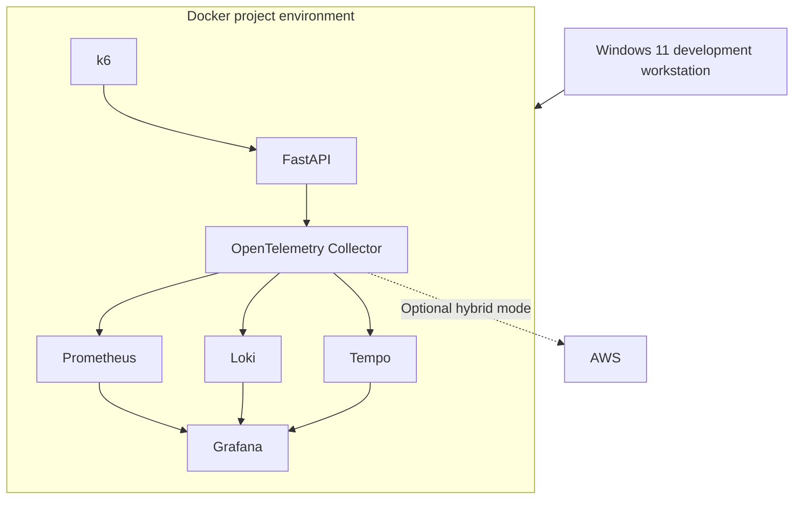

# ADR 0006: Run the Initial Platform on the Development Workstation

- **Status:** Accepted
- **Date:** 2026-08-21
- **Decision owners:** Project maintainer
- **Scope:** Initial local deployment environment
- **Related decisions:** ADR 0001, ADR 0002, ADR 0003, ADR 0004, ADR 0005

---

## Context

The Hybrid Observability Platform requires an initial runtime environment for:

- the instrumented FastAPI application;
- OpenTelemetry Collector;
- Prometheus;
- Loki;
- Tempo;
- Grafana;
- controlled k6 workloads;
- local configuration validation;
- optional AWS hybrid integration;
- Docker-based lifecycle testing.

Two local computers are available for project work.

### Development workstation

The primary development workstation is a Windows 11 notebook with:

- AMD Ryzen 5 processor;
- 32 GB of RAM;
- approximately 480 GB of SSD storage;
- Visual Studio Code;
- Docker-based development tooling;
- AWS CLI and Terraform tooling;
- daily development access.

### Dedicated laboratory computer

The dedicated laboratory computer provides:

- Intel Core i7-2600 processor;
- 16 GB of RAM;
- approximately 480 GB of SSD storage;
- a role as a dedicated infrastructure and engineering laboratory;
- planned use for TCC2 and subsequent observability projects.

The dedicated laboratory computer must remain available for:

- the TCC2 implementation;
- persistent Linux services;
- longer-running observability environments;
- heavier infrastructure experiments;
- future multi-host scenarios;
- projects derived from the academic framework.

Using the dedicated laboratory computer for the initial portfolio implementation would mix project responsibilities and introduce unnecessary coupling between:

- Fiverr portfolio evidence;
- GitHub implementation work;
- TCC2 academic infrastructure;
- future persistent laboratory services.

The initial platform is designed for short, controlled, and reproducible execution rather than continuous operation.

---

## Decision

The initial Hybrid Observability Platform will run on the development workstation.

The default local environment will use:

- Windows 11 as the host operating system;
- Docker-based container execution;
- Docker Compose for service orchestration;
- Docker-managed project volumes for runtime telemetry;
- local browser access to Grafana;
- local command-line tooling for validation;
- optional authenticated AWS access for hybrid mode.

The dedicated laboratory computer will not be required for the initial implementation.

The project architecture is:



The workstation is a development and validation environment.

It is not a production server.

---

## Decision Drivers

### Resource availability

The development workstation provides more memory than the dedicated laboratory computer and is suitable for the initial single-node container stack.

### Environment isolation

The decision keeps the portfolio project separated from TCC2 infrastructure and data.

### Development efficiency

The workstation already contains the primary development, cloud, and infrastructure tooling.

### Reproducibility

The platform can be started, stopped, recreated, and removed through Docker Compose.

### Short execution lifecycle

The project does not require continuous availability or long-term telemetry storage.

### Cost control

Local execution avoids continuous AWS compute and managed observability charges.

### Operational convenience

The project can be developed and validated without requiring remote access to another computer.

### Future portability

The containerized architecture can later move to:

- the dedicated laboratory computer;
- a Linux server;
- an AWS compute environment;
- a multi-host deployment;
- Kubernetes.

---

## Host Responsibilities

The Windows development workstation is responsible for:

- Docker runtime execution;
- local source-code editing;
- local telemetry storage;
- browser-based Grafana access;
- Terraform execution;
- AWS CLI authentication;
- validation scripts;
- controlled workload generation;
- evidence capture.

The host must not become responsible for:

- continuous production monitoring;
- permanent telemetry retention;
- public observability services;
- third-party production data;
- TCC2 runtime services;
- always-on AWS exporters.

---

## Container Runtime

The project will use Docker Compose as the initial orchestration mechanism.

Compose must define:

- service names;
- project-specific networks;
- project-specific volumes;
- health checks;
- dependency conditions where technically appropriate;
- environment-variable contracts;
- restart behavior;
- resource controls;
- exposed ports;
- configuration mounts;
- image versions.

The project must not rely on manually created containers.

Commands executed outside the version-controlled lifecycle must be documented if they materially affect the environment.

---

## Windows and WSL Considerations

Docker on Windows commonly uses a WSL 2-based runtime.

The implementation must account for:

- Docker virtual-disk growth;
- WSL memory behavior;
- filesystem performance differences;
- Windows and Linux path conventions;
- line-ending differences;
- file-permission behavior;
- localhost port exposure;
- Docker Desktop startup state;
- host shutdown and sleep behavior.

Configuration files executed inside Linux containers must use compatible line endings.

Runtime data should use Docker-managed volumes unless a documented requirement justifies a host bind mount.

Large telemetry datasets should not use inefficient cross-filesystem mounts merely for easier visual inspection.

---

## Project Storage

Runtime telemetry will use clearly named project volumes.

The logical storage model includes:

```text
hybrid-observability-prometheus-data
hybrid-observability-loki-data
hybrid-observability-tempo-data
hybrid-observability-grafana-data
```

Volume names may be generated through a Compose project prefix, but they must remain clearly attributable to this repository.

The implementation must provide commands or scripts to:

- list project volumes;
- inspect project volume usage;
- stop services without deleting data;
- restart services with retained data;
- remove project telemetry deliberately;
- verify cleanup.

No cleanup procedure may remove all Docker volumes from the workstation.

---

## Resource Budget

The platform must operate within a bounded workstation resource budget.

Initial engineering targets are:

| Resource | Initial target |
|---|---:|
| Aggregate platform memory at idle | At or below 4 GB |
| Aggregate platform memory under controlled load | At or below 8 GB |
| Project telemetry storage | At or below 10 GB |
| Host free disk safety margin | At least 20% |
| Continuous execution | Not required |
| Normal retention | 24–48 hours by signal |

These are validation targets rather than guaranteed measurements.

Actual consumption must be measured after the first functional deployment.

If the platform exceeds a target, the project must determine whether to:

- reduce ingestion;
- reduce retention;
- reduce trace sampling;
- reduce log volume;
- modify scrape intervals;
- apply container limits;
- change backend configuration;
- revise the target with documented evidence.

The project must not silently increase resource allocation to hide inefficient configuration.

---

## CPU Consumption

No fixed CPU target will be claimed before baseline measurements are available.

The implementation must separately measure:

- idle CPU usage;
- normal application traffic;
- controlled k6 load;
- compaction activity;
- dashboard query activity;
- startup and recovery activity.

CPU-intensive load generation must be:

- time-bounded;
- manually initiated;
- observable;
- abortable;
- separated from idle baseline measurements.

The workstation must remain usable for development during normal platform operation.

---

## Memory Controls

Memory consumption must be controlled at multiple levels.

### OpenTelemetry Collector

The Collector must use:

- memory limiting;
- batch processing;
- bounded queues;
- controlled retries.

### Containers

Container memory limits or reservations should be introduced after baseline measurements demonstrate appropriate values.

Limits must not be so restrictive that they create artificial failures during normal operation.

### Docker and WSL

Docker or WSL resource allocation may be bounded at the host level when required.

Any host-level resource setting must be documented because it can affect unrelated Docker projects.

---

## Disk Controls

The project must protect both:

- the host SSD;
- the Docker-managed virtual disk.

Controls include:

- Prometheus retention;
- Loki retention;
- Tempo retention;
- trace sampling;
- log filtering;
- bounded k6 workloads;
- project-specific volumes;
- storage measurement;
- explicit cleanup.

Deleting data inside a Linux container does not guarantee that the Windows-hosted virtual-disk file immediately decreases in apparent size.

The project must distinguish between:

- storage freed inside the Docker environment;
- physical virtual-disk compaction on the Windows host.

Host-level Docker or WSL maintenance is outside normal application cleanup and must be documented separately if required.

---

## Network Exposure

The platform will use a project-specific container network.

Service ports must follow minimum-exposure principles.

The initial access model should be:

| Component | Host exposure |
|---|---|
| Grafana | Localhost only |
| FastAPI | Localhost only when required |
| Prometheus | Localhost only when operational access is required |
| Loki | No direct host exposure unless required |
| Tempo | No direct host exposure unless required |
| OpenTelemetry Collector OTLP | No broader exposure than required |
| Internal health endpoints | Project network or localhost only |

No service should bind to all host interfaces by default without a documented requirement.

The local platform must not be reachable from the public internet.

---

## Availability Expectations

The workstation may:

- sleep;
- restart;
- shut down;
- lose network connectivity;
- stop Docker;
- receive operating-system updates.

The platform therefore does not provide:

- continuous availability;
- production monitoring guarantees;
- high availability;
- durable telemetry ingestion during host shutdown;
- disaster recovery.

This behavior is acceptable for the initial scope.

The project must validate recovery after:

- an ordinary container restart;
- Docker restart;
- workstation restart where practical;
- interrupted application execution;
- interrupted Collector execution.

---

## Security Considerations

Running the platform on the development workstation introduces risks involving:

- local credentials;
- Docker daemon access;
- exposed host ports;
- telemetry containing host information;
- screenshots revealing filesystem paths;
- AWS sessions available on the workstation;
- malicious or vulnerable container images.

Required controls include:

- no credentials embedded in Compose files;
- no Docker socket mounting unless explicitly justified;
- restricted port binding;
- pinned images;
- container scanning;
- project-specific networks;
- project-specific volumes;
- sanitized telemetry;
- reviewed screenshots;
- temporary AWS sessions;
- no public OTLP endpoints.

Docker daemon access must be treated as privileged host access.

---

## AWS Authentication on the Workstation

Hybrid mode may use an authenticated AWS CLI or IAM Identity Center session.

The project must:

- verify the active account;
- verify the active identity;
- verify the selected region;
- avoid static credentials;
- avoid committing profile configuration;
- ensure local mode works after the AWS session expires.

AWS authentication must not be passed into containers more broadly than required.

If the Collector requires AWS identity, the selected credential mechanism must be documented and constrained.

---

## Evidence and Benchmark Integrity

Performance evidence generated on the workstation must identify the environment as:

```text
single-workstation development environment
```

Results must not be represented as:

- production capacity;
- cloud benchmark results;
- multi-host performance;
- enterprise scalability;
- general backend performance guarantees.

Measurements may be influenced by:

- Windows host activity;
- Docker runtime overhead;
- WSL resource allocation;
- browser activity;
- background processes;
- SSD state;
- power-management settings;
- other development tools.

Evidence must distinguish architecture validation from formal benchmarking.

---

## TCC2 Environment Separation

The dedicated laboratory computer remains reserved for TCC2 and subsequent projects.

The initial Hybrid Observability Platform must not require:

- storage volumes on the laboratory computer;
- permanent agents on the laboratory computer;
- network access to the laboratory computer;
- TCC2 credentials;
- TCC2 datasets;
- shared project databases.

Future integration with the laboratory computer must be deliberate and documented through a new ADR.

This separation prevents portfolio experiments from altering academic evidence or persistent TCC2 infrastructure.

---

## Lifecycle

The expected workstation lifecycle is:

```text
Validate host prerequisites
        |
        v
Start project services
        |
        v
Verify service health
        |
        v
Generate controlled workload
        |
        v
Inspect metrics, logs, and traces
        |
        v
Capture reviewed evidence
        |
        v
Stop services
        |
        v
Retain or explicitly remove project volumes
```

The environment will not remain active solely to preserve dashboard appearance.

Telemetry can be regenerated when required.

---

## Alternatives Considered

### Use the dedicated laboratory computer

This option was rejected for the initial implementation because:

- the machine is reserved for TCC2;
- it has less memory than the development workstation;
- it would mix project responsibilities;
- it would create network and remote-access dependencies;
- it would complicate cleanup and evidence separation.

### Run the platform permanently in AWS

This option was rejected because it would:

- introduce recurring compute and storage costs;
- require continuous credential and security management;
- make local development cloud-dependent;
- conflict with the local-first storage strategy.

AWS remains an optional hybrid integration environment.

### Use multiple local computers

A multi-host environment was rejected initially because:

- it is not required to validate the telemetry pipeline;
- it introduces networking complexity;
- it complicates repeatability;
- it would use the reserved laboratory computer.

Multi-host deployment remains a future evolution.

### Use Kubernetes on the workstation

Kubernetes was rejected for the initial implementation because:

- Docker Compose satisfies the single-workstation requirement;
- Kubernetes would add control-plane resource consumption;
- the current goal is observability-pipeline validation rather than orchestration-platform evaluation;
- it would increase troubleshooting surface.

A Kubernetes deployment may be considered later.

### Use a managed observability SaaS

This option was rejected as the default because:

- the project requires local backend operation;
- managed ingestion creates external dependency;
- pricing and service limits may change;
- the project aims to demonstrate backend configuration and retention.

---

## Consequences

### Positive consequences

- The dedicated TCC2 computer remains clean and available.
- The platform uses the workstation with greater memory capacity.
- Development and validation remain locally accessible.
- Routine execution does not require AWS compute.
- The complete environment is reproducible through containers.
- Telemetry can be generated and removed on demand.
- Local and hybrid modes can be tested from one development environment.
- Operational overhead remains appropriate for the initial scope.

### Negative consequences

- The workstation carries the project resource load.
- Docker and WSL consume local SSD space.
- Telemetry is unavailable when the workstation is off.
- Background host activity affects performance measurements.
- No high availability is provided.
- Localhost port management is required.
- Docker runtime problems can affect the full platform.
- The development environment is not identical to a Linux production host.

### Operational risks

- Docker Desktop may not be running.
- WSL may retain memory after workloads stop.
- Docker virtual-disk storage may grow.
- Port collisions may occur.
- Host sleep may interrupt ingestion.
- Windows updates may restart the environment.
- Broad cleanup commands may affect unrelated Docker projects.
- High k6 load may reduce workstation responsiveness.
- Antivirus or filesystem scanning may affect container performance.

---

## Migration Conditions

The platform may move from the development workstation if requirements include:

- continuous monitoring;
- multi-host telemetry;
- dedicated Linux runtime;
- long-term availability;
- increased ingestion volume;
- additional monitored services;
- distributed tracing across hosts;
- Kubernetes;
- external user access;
- separation between load generation and monitoring;
- TCC2 integration.

A migration must be documented through a new ADR.

---

## Migration Options

Potential future environments include:

- the dedicated laboratory computer after TCC2 isolation requirements are satisfied;
- an additional Linux host;
- multiple local hosts;
- Amazon EC2;
- Amazon ECS;
- Amazon EKS;
- another cloud provider;
- a dedicated on-premises observability server.

Migration must preserve:

- OpenTelemetry instrumentation;
- Collector pipeline contracts;
- retention controls;
- service identities;
- dashboard queries;
- security controls;
- cleanup procedures.

---

## Validation Criteria

This decision will be considered successfully implemented when:

- the full local stack starts on the development workstation;
- the dedicated laboratory computer is not required;
- Docker services use project-specific networks and volumes;
- metrics, logs, and traces remain queryable;
- local data survives ordinary service restarts;
- aggregate resource consumption is measured;
- the idle memory target is evaluated;
- the controlled-load memory target is evaluated;
- project telemetry remains below the storage target or deviations are documented;
- host ports are restricted;
- the workstation remains usable under normal project operation;
- project-only cleanup is validated;
- local mode operates without AWS credentials;
- hybrid mode can authenticate without committed static credentials.

---

## Reversibility

This decision is reversible.

The containerized architecture and OpenTelemetry contract allow the platform to migrate to another host or orchestration environment.

Any change making the dedicated laboratory computer, AWS, Kubernetes, or another permanent runtime mandatory requires a new ADR.

---

## References

- [Docker Compose documentation](https://docs.docker.com/compose/)
- [Docker volumes](https://docs.docker.com/engine/storage/volumes/)
- [Docker resource constraints](https://docs.docker.com/engine/containers/resource_constraints/)
- [Docker Desktop WSL 2 backend](https://docs.docker.com/desktop/features/wsl/)
- [Microsoft WSL configuration](https://learn.microsoft.com/windows/wsl/wsl-config)
- [OpenTelemetry Collector deployment](https://opentelemetry.io/docs/collector/deployment/)
- [Prometheus storage](https://prometheus.io/docs/prometheus/latest/storage/)
- [Grafana Loki storage](https://grafana.com/docs/loki/latest/configure/storage/)
- [Grafana Tempo configuration](https://grafana.com/docs/tempo/latest/configuration/)
